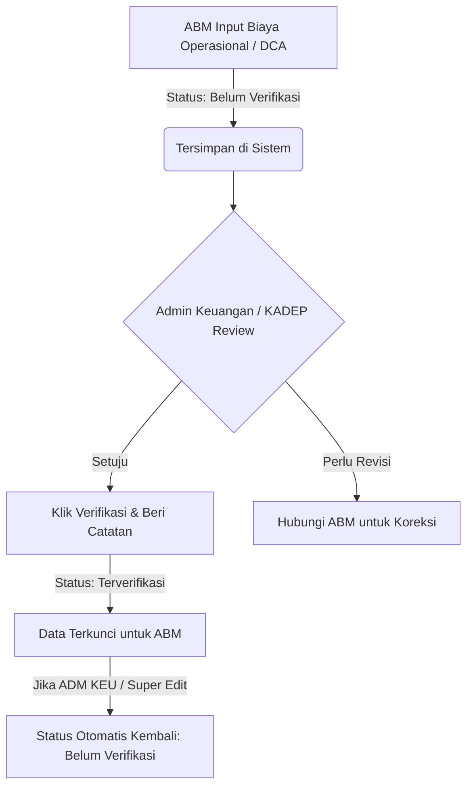

# BUKU PANDUAN PENGGUNAAN APLIKASI KMT CORN
**Sistem Informasi ERP PT Karisma Indoagro Universal**
*Modul Monitoring Biaya Operasional, DCA, Omset, & Analisis Cost / Hasil Komoditas Jagung*

---

## DAFTAR ISI
1. [Tentang Modul KMT CORN](#1-tentang-modul-kmt-corn)
2. [Hak Akses & Peran Pengguna (User Roles)](#2-hak-akses--peran-pengguna-user-roles)
3. [Dashboard KMT CORN (Cost / Hasil YTD)](#3-dashboard-kmt-corn-cost--hasil-ytd)
4. [Modul Data Omset & Retur Penjualan](#4-modul-data-omset--retur-penjualan)
5. [Modul Biaya DCA (Demonstration & Cost Activities)](#5-modul-biaya-dca-demonstration--cost-activities)
6. [Modul Biaya Operasional Lapangan](#6-modul-biaya-operasional-lapangan)
7. [Modul Promo Material & Peralatan](#7-modul-promo-material--peralatan)
8. [Modul Biaya Lain-Lain (Others)](#8-modul-biaya-lain-lain-others)
9. [Modul Penggajian (Gaji Karyawan Lapangan)](#9-modul-penggajian-gaji-karyawan-lapangan)
10. [Workflow Verifikasi & Kontrol Keuangan](#10-workflow-verifikasi--kontrol-keuangan)
11. [Panduan Import & Export Excel](#11-panduan-import--export-excel)
12. [Pertanyaan Umum (FAQ) & Penanganan Masalah](#12-pertanyaan-umum-faq--penanganan-masalah)

---

## 1. Tentang Modul KMT CORN
Modul **KMT CORN** dirancang khusus untuk memonitoring, mencatat, dan menganalisis performa bisnis divisi jagung (seperti benih **BISI 959**, **Q-235 CLING**, dan varietas lainnya). 

Tujuan utama sistem ini adalah menghitung **Rasio Cost / Hasil (Biaya terhadap Omset)** secara real-time, baik secara konsolidasi nasional, per wilayah, maupun bulanan (*Year to Date / YTD*).

### Indikator Kunci Rasio Cost / Hasil:
$$\text{Cost / Hasil (\%)} = \left( \frac{\text{Total Biaya}}{\text{Total Omset}} \right) \times 100\%$$
- 🟢 **< 20% (Efisien / Aman)**: Indikator hijau, rasio operasional sehat.
- 🟡 **20% – 30% (Waspada / Perhatian)**: Indikator kuning, rasio biaya mendekati ambang batas.
- 🔴 **> 30% (Kritis / Over Budget)**: Indikator merah, biaya melebihi toleransi target efisiensi.

---

## 2. Hak Akses & Peran Pengguna (User Roles)

Sistem membagi kewenangan pengguna ke dalam 3 tingkatan:

| Fitur / Menu | Level 1: KADEPKS / Super Admin | Level 2: ADMKEU (Admin Keuangan) | Level 3: ABM (Area Business Manager) |
| :--- | :---: | :---: | :---: |
| **Cakupan Wilayah** | Seluruh Wilayah (Nasional) | Seluruh Wilayah (Nasional) | Hanya Wilayah Tugasnya Sendiri |
| **Dashboard Cost / Hasil** | Full Access & Export | Full Access & Export | Read-Only (Wilayah Sendiri) |
| **Data Omset & Retur** | Input, Edit, Import, Export | Input, Edit, Import, Export | Tidak Dapat Menginput |
| **Biaya Operasional** | View, Edit, Verifikasi, Export | View, Verifikasi, Export (No Input) | Input & Edit Data Wilayah Sendiri |
| **Biaya DCA** | Input, Edit, Verifikasi, Export | Verifikasi, Export, Tambah Kegiatan | Input & Edit Data Wilayah Sendiri |
| **Promo & Peralatan** | Input, Edit, Import, Export | Input, Edit, Import, Export | Tidak Ada Akses |
| **Biaya Gaji** | Input, Edit, Import, Export | Tidak Ada Akses | Tidak Ada Akses |
| **Biaya Others** | Input, Edit, Export | Input, Edit, Export | Tidak Ada Akses |

> **Catatan Penting Keamanan:**
> Jika data Operasional atau DCA **sudah diverifikasi** oleh Admin Keuangan / KADEP, akun ABM tidak dapat lagi mengubah atau menghapus data tersebut (terkunci otomatis demi validitas pembukuan).

---

## 3. Dashboard KMT CORN (Cost / Hasil YTD)
**Menu URL**: `kmt/dashboard`

### 3.1. Fitur Utama Dashboard
1. **Filter Periode & Wilayah**:
   - **Tahun**: Pilih tahun pembukuan.
   - **Dari Bulan - Sampai Bulan**: Fleksibel melihat periode tertentu (misal Q1: Jan–Mar, Semester 1: Jan–Jun, atau 1 tahun penuh: Jan–Des).
   - **Wilayah**: Memilih wilayah tertentu atau "Semua Wilayah" (untuk Level 1 & 2).
2. **Kartu Ringkasan (KPI Cards)**:
   - **Total Omset**: Akumulasi penjualan jagung neto inc PPN.
   - **Total Biaya**: Total pengeluaran (Operasional + DCA + Promo + Peralatan + Others + Gaji).
   - **Total Gaji**: Khusus pengeluaran kompensasi SDM.
   - **Cost / Hasil (YTD)**: Persentase efisiensi dengan warna indikator otomatis.
3. **Tabel Rekap YTD Bulanan**:
   - Menampilkan baris per bulan (Januari s.d. Desember) lengkap dengan kolom:
     *Omset, Operasional, DCA, Peralatan, Others, Gaji, Total Biaya, dan Cost/Hasil (%)*.
4. **Tabel Cost / Hasil per Wilayah**:
   - Evaluasi kuartal (Q1, Q2, Q3, Q4, dan Total Tahunan) untuk setiap wilayah operasional.
5. **Tombol Export Excel Dashboard**:
   - Mengunduh file Excel multi-sheet otomatis (Sheet 1: Konsolidasi Semua Wilayah, Sheet berikutnya: per masing-masing wilayah).

---

## 4. Modul Data Omset & Retur Penjualan
**Menu URL**: `kmt/omset`

### 4.1. Input Data Omset Manual
1. Masuk ke menu **Omset** $\rightarrow$ klik tombol **Tambah Data**.
2. Isi formulir transaksi:
   - **Tanggal Penjualan**: Tanggal faktur/pengiriman.
   - **Wilayah**: Pilih wilayah pemasaran toko terkait.
   - **Nama Toko / Kios**: Nama customer/kios penerima barang.
   - **Kota / Kabupaten & Kode SC**: Identitas sales/area.
   - **Produk Jagung**: Varietas benih (misal: *BISI 959*, *Q-235 CLING*).
   - **Quantity & Satuan**: Jumlah sak / karton / kg (unit).
   - **Harga Inc PPN**: Harga jual satuan termasuk pajak.
   - Nilai **DPP** dan **Inc PPN Neto** akan terkalkulasi otomatis.
3. Klik **Simpan**.

### 4.2. Pencatatan Retur Penjualan Terintegrasi
Jika terjadi pengembalian barang (kadaluarsa, cacat, atau retur konsinyasi):
1. Pada baris toko di tabel Omset, klik tombol **Retur**.
2. Klik **Tambah Retur**.
3. Isi nomor dokumen retur, tanggal retur, jumlah quantity yang diretur, dan nilai nominalnya.
4. Tentukan opsi **Kurangi Target Omset**:
   - **Ya (Kurangi Target)**: Nilai omset toko tersebut akan otomatis dipotong sebesar nilai retur, sehingga angka omset di Dashboard otomatis terkoreksi.
   - **Tidak (Hanya Catatan)**: Retur dicatat untuk audit logistik tanpa mengubah pencapaian target omset.
5. Klik **Simpan**.

---

## 5. Modul Biaya DCA (Demonstration & Cost Activities)
**Menu URL**: `kmt/dca`

DCA digunakan untuk mencatat pendanaan dan realisasi program promosi lapangan seperti:
- **BFM** (Big Farmer Meeting)
- **FM** (Farmer Meeting)
- **FFD** (Farmers Field Day)
- **ODP / Expo / Demo Plot**

### 5.1. Formulir Pengajuan & Realisasi DCA (Multi Kegiatan)
1. Buka menu **DCA** $\rightarrow$ klik **Tambah DCA**.
2. Masukkan data umum:
   - **Tanggal DCA**: Tanggal pelaksanaan atau penutupan kasbon.
   - **Wilayah & ABM**: Area kerja dan penanggung jawab ABM.
   - **Nama MDO**: Market Development Officer pelaksana di lapangan.
   - **Uang Muka (UM)**: Dana kasbon yang diterima di awal dari finance.
3. Masukkan rincian kegiatan pada tabel dinamis (bisa menambahkan lebih dari 1 kegiatan sekaligus):
   - **Jenis Kegiatan**: Pilih kegiatan (bisa tambah master baru jika belum ada).
   - **Tgl Kasbon & Tgl Kegiatan**.
   - **Jumlah Peserta**: Petani/kios yang hadir.
   - **Qty Penjualan Langsung**: Jumlah sak *BISI 959* dan *Q-235* yang terdistribusi/laku saat acara.
   - **Realisasi Biaya (Rp)**: Biaya riil konsumsi, sewa tenda, sound system, dsb.
   - **Keterangan**: Catatan lokasi/desa kegiatan.
4. **Sistem Perhitungan Otomatis**:
   $$\text{Total Realisasi} = \sum \text{Realisasi Biaya Kegiatan}$$
   $$\text{Refund (Sisa Kasbon Dikembalikan)} = \max(0, \text{UM} - \text{Total Realisasi})$$
5. Klik **Simpan Data**.

### 5.2. Rekapitulasi Berjenjang DCA & Export Rincian
- **Menu Rekap**: Melihat data yang dikelompokkan secara hierarkis:
  $$\text{ABM} \longrightarrow \text{MDO} \longrightarrow \text{Jenis Kegiatan}$$
- **Export Excel Rincian**: Menghasilkan dokumen Excel ukuran A3 Landscape lengkap dengan kolom verifikator dan catatan validasi.

---

## 6. Modul Biaya Operasional Lapangan
**Menu URL**: `kmt/operasional`

Digunakan untuk mencatat beban operasional harian tim sales/MDO/ABM.

### 6.1. Pos-Pos Biaya yang Dicatat
Sistem menyediakan 15 pos alokasi biaya:
1. **Hotel / Penginapan**
2. **Per Diem (Uang Harian / Uang Makan)**
3. **Entertainment (Jamuan Tamu / Toko)**
4. **Communication (Paket Data / Pulsa)**
5. **ATK (Alat Tulis Kantor)**
6. **Gasoline (BBM Kendaraan Dinas)**
7. **Sparepart & Service (Perawatan Kendaraan)**
8. **Retribusi, Tol, & Parkir**
9. **Transportasi (Tiket Travel, Bus, Kereta, dll.)**
10. **Pos & Paket (Ongkos Kirim Dokumen/Sampel)**
11. **Tambah Angin**
12. **Tambal Ban**
13. **Indekost (Mess Lapangan)**
14. **Sewa Kendaraan**
15. **Lain-lain**

### 6.2. Uang Muka & Refund Operasional
- Field **UM (Uang Muka)** mencatat kasbon operasional yang dibawa.
- Field **Total Biaya** dihitung otomatis dari penjumlahan seluruh pos biaya di atas.
- Field **Refund** otomatis terisi jika $\text{UM} > \text{Total Biaya}$.

---

## 7. Modul Promo Material & Peralatan
**Menu URL**: `kmt/promo`

Mencatat pengadaan barang pendukung promosi di kios atau sawah:
- **Promo Material**: Spanduk, banner, kaos promosi jagung, topi, brosur.
- **Peralatan**: Timbangan jagung, moisture meter, tenda display, rak benih kios.

Setiap penginputan mencakup tanggal, supplier/vendor pengadaan, nama item, rincian biaya promo/peralatan, dan wilayah alokasi.

---

## 8. Modul Biaya Lain-Lain (Others)
**Menu URL**: `kmt/others`

Digunakan untuk mencatat pengeluaran yang tidak termasuk ke dalam kategori DCA, Operasional Harian, maupun Promo Material (misal: legalitas perizinan lokal, donasi/CSR desa sekitar demo plot, perbaikan mendadak fasilitas kantor cabang).

---

## 9. Modul Penggajian (Gaji Karyawan Lapangan)
**Menu URL**: `kmt/gaji`
*(Akses Khusus: Level 1 - Kepala Departemen / Super Admin)*

### Fitur Penggajian:
1. Menampilkan matriks data 12 bulan (Januari s.d. Desember) dalam satu tabel tahunan per nama karyawan.
2. Identitas posisi, status aktif/resign, serta tanggal bergabung atau keluar.
3. Otomatis masuk ke dalam komponen pembentuk **Total Biaya** pada Dashboard Cost / Hasil.
4. Mendukung fasilitas **Import Excel Gaji** untuk mempermudah upload massal slip payroll.

---

## 10. Workflow Verifikasi & Kontrol Keuangan

Untuk menjamin integritas data pengeluaran kas perusahaan, modul DCA dan Operasional menerapkan alur verifikasi ganda:

### Aturan Verifikasi:
1. **Hak Verifikasi**: Hanya dimiliki oleh Level 2 (Admin Keuangan) dan Level 1 (Super Admin).
2. **Penguncian Data**: Begitu baris data terverifikasi (tanda centang hijau):
   - ABM hanya memiliki hak *View* (tidak dapat mengubah nominal atau menghapus).
3. **Audit Otomatis Jika Terjadi Edit Ulang**:
   - Jika Admin Keuangan atau KADEP mengubah data yang telah diverifikasi, status verifikasi **otomatis gugur (reset ke 0)** dan tercatat di log verifikasi agar diperiksa kembali secara transparan.

---

## 11. Panduan Import & Export Excel

### 11.1. Panduan Import Data dari Excel
Fitur import tersedia pada modul: **Omset, DCA, Promo Material, Retur, dan Gaji**.
1. Masuk ke halaman daftar data yang ingin di-import.
2. Klik tombol **Import Excel**.
3. Klik tautan **Download Format Excel (Template)** terlebih dahulu.
4. Isi data pada kolom template tanpa mengubah urutan atau nama header kolom.
5. Unggah kembali file Excel (.xlsx / .xls) yang telah diisi.
6. Sistem akan memvalidasi data dan mengonfirmasi jumlah baris yang berhasil diimpor.

### 11.2. Panduan Export Data ke Excel
Setiap tabel data dan dashboard dilengkapi tombol **Export Excel**:
- Data yang diexport otomatis mengikuti kriteria filter yang sedang aktif (Tahun, Bulan, Wilayah).
- Khusus DCA, tersedia 3 jenis export:
  - **Export Ringkasan**: Rekap tabel daftar DCA.
  - **Export Rincian**: Dokumen rinci detail kegiatan.
  - **Export Rekap Berjenjang**: Format laporan resmi siap cetak per lembar ABM.

---

## 12. Pertanyaan Umum (FAQ) & Penanganan Masalah

**Q: Mengapa saya sebagai ABM tidak menemukan menu Omset atau Gaji?**  
*A: Kebijakan sistem membatasi akses data omset dan gaji hanya untuk manajemen pusat (Finance dan KADEP). ABM difokuskan pada pengelolaan kegiatan lapangan (DCA dan Operasional).*

**Q: Saya salah memasukkan nominal DCA, tetapi tombol Edit tidak bisa diklik. Mengapa?**  
*A: Data tersebut sudah diverifikasi oleh Admin Keuangan. Silakan berkoordinasi dengan Admin Keuangan pusat untuk membatalkan verifikasi data terkait terlebih dahulu.*

**Q: Mengapa persentase Cost / Hasil di Dashboard berwarna merah?**  
*A: Persentase berwarna merah jika rasio pengeluaran biaya terhadap omset melebihi 30%. Hal ini menandakan biaya kegiatan di periode/wilayah tersebut melampaui ambang batas ideal efisiensi.*

**Q: Apakah data retur mengurangi omset secara otomatis?**  
*A: Tergantung opsi `Kurangi Target` saat menyimpan retur. Jika dipilih "Ya", nilai penjualan netto omset terkait otomatis dikurangi sebesar nilai retur.*

---
*Dokumen ini dibuat dan dikelola oleh Tim Pengembang Karisma ERP — PT Karisma Indoagro Universal.*
