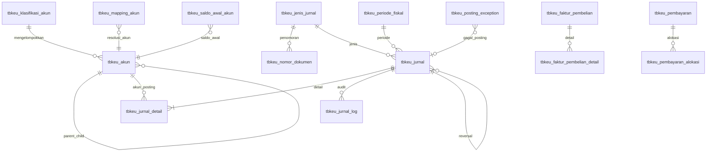

# FASE 0 - Audit Result Accounting

Tanggal audit: 2026-07-10  
Scope: audit dan implementation planning modul accounting KARISMA ERP.  
Status: belum implementasi. Tidak ada controller, model, view, route, migration, atau tabel yang diubah.

## Catatan Dokumen Sumber

Instruksi meminta membaca:

- `docs/AGENTS.md`
- `docs/accounting/MASTER_SPEC.md`
- `docs/database/kiucoid_karismaerp_local_master.sql`

File yang tersedia di repository:

- `docs/AGENT.md`
- `docs/accounting/MASTER_SPECS.md`
- `docs/database/kiucoid_karismaerp_local_master.sql`

Audit ini memakai `docs/AGENT.md` dan `docs/accounting/MASTER_SPECS.md` sebagai kandidat sumber karena path persis yang diminta tidak ada. Ini menjadi risiko dokumentasi dan perlu diputuskan sebelum fase implementasi.

## Struktur Project CodeIgniter 3

Project menggunakan struktur CodeIgniter 3 klasik:

| Area | Path | Catatan |
| --- | --- | --- |
| Front controller | `index.php` | Entry point aplikasi. |
| Config | `application/config` | `routes.php` berisi route custom lintas modul. |
| Controllers | `application/controllers` | Modul domain dibuat sebagai subfolder: `sales`, `logistik`, `keuangan`, `admin`, `api`, `master`, dll. |
| Models | `application/models` | Beberapa model domain masih berada di root model, misalnya `M_Logistik`, `M_SalesOrder`, `M_Keuangan`. |
| Views | `application/views` | View dipisah ke `content/*` dan `partial/*`. |
| Libraries | `application/libraries` | Belum ada folder `Accounting`; ada library umum dan dokumen stock. |
| Database dump | `docs/database/kiucoid_karismaerp_local_master.sql` | Dipakai sebagai sumber analisis struktur. |
| Existing docs | `docs` | Banyak dokumen development/database lama; accounting folder sudah ada namun sebagian file kosong/salah nama. |

Route penting yang ditemukan:

- Sales Order: `sales_order`, `sales_order/create`, `sales_order/store`, `sales_order/detail/(:any)`, `sales_order/approve`, `sales_order/confirm_loading`.
- DO/logistik: `logistik`, `create_do`, `detail_do/(:any)`, `rekam_order_check`, `do/confirm_sales`, `do/repost_status`.
- LPB/PO: `ics/icspo`, `ics/ajax_finalize_tmp_po_received`, `ics/print_lpb_record/(:num)`, `logistik/lpb`.
- Retur: `ics/retur/penjualan/*`, `ics/retur/pembelian/*`.
- Mutasi stock: `ics/mutasi_barang`, `ics/mutasi_barang/input`, `ics/ajax_rekam_mutasi`, `ics/ajax_rollback_mutasi`, `ics/ajax_unpost_mutasi`.
- Stockopname: `admin/stockopname/*`, `stockopname/input`, `stockopname/history-input`.
- Keuangan existing: route `keuangan` saat ini adalah modul daily stock/pending PO lama, bukan modul GL accounting.

## Flow Source Transaction

### 1. Penjualan dan Sales Order

Code path utama:

- Controller: `application/controllers/sales/C_SalesOrder.php`
- Model: `application/models/M_SalesOrder.php`
- View: `application/views/content/sales/*`
- Tables: `tbso_sales_order`, `tbso_sales_order_detail`, `tbso_so_approval` disebut di code tetapi tidak ada di dump, `tb_customer`, `tberp_stock_ledger`, `tberp_stock_batch`

Flow yang ditemukan:

1. `sales_order/store` membuat header `tbso_sales_order` dan detail `tbso_sales_order_detail`.
2. Status awal: `draft` atau `waiting_approval` bila ada harga nego.
3. Saat create/update SO, model menulis `tberp_stock_ledger` tipe `RESERVE` dan menambah `tberp_stock_batch.qty_reserved`.
4. Approval mengubah approval menjadi `approved` atau mengembalikan SO ke `draft`.
5. Cancel mengubah SO menjadi `cancelled`, release reservation, dan menulis stock ledger tipe `RELEASE`.
6. Partial delivery dapat mengubah status menjadi `partial_delivered` atau `completed` di code, tetapi enum dump tidak memuat `partial_delivered`.

Catatan status:

- Dump enum `tbso_sales_order.status`: `draft`, `open`, `sedang_verifikasi`, `siap_faktur`, `partial`, `completed`, `cancelled`.
- Code memakai juga `waiting_approval`, `approved`, `in_progress`, `done`, `partial_delivered`.
- Ini inkonsistensi kritis antara source code dan dump.

Titik posting accounting yang aman belum final. Kandidat terkuat:

- Faktur penjualan: bukan saat SO dibuat, karena SO baru reserve stock dan belum final.
- Revenue/HPP: kandidat saat DO dikonfirmasi sales `action = siap` pada `do/confirm_sales`, karena status SO disinkron menjadi `done`.
- Namun belum ada tabel `tbso_faktur_penjualan` dan `tbso_faktur_detail` di dump; flow faktur penjualan existing memakai `tb_pre_do`, `tb_do`, dan `tb_detail_do`.

### 2. Faktur Penjualan dan Delivery Order

Code path utama:

- Controller: `application/controllers/logistik/C_Logistik.php`
- Model: `application/models/M_Logistik.php`
- Tables: `tb_pre_do`, `tb_do`, `tb_detail_do`, `tb_customer`, `tb_master_barang_all`, `tberp_stock_ledger`

Flow yang ditemukan:

1. Data faktur/DO berasal dari `tb_pre_do` atau dari SO melalui `M_Logistik`.
2. Draft/detail DO dipindahkan ke `tb_detail_do`.
3. `rekam_order_check` mengubah `tb_do.status = 2`, `tb_detail_do.dt_status = 1`, `tb_detail_do.status = 4`, menulis log, dan menulis `tberp_stock_ledger` melalui `finalize_ledger_do`.
4. `confirm_sales` menerima `action = siap` atau `belum_siap`.
5. Jika `siap`, SO terkait disinkron menjadi `done`.
6. `repost_status` dapat mengembalikan status DO dan SO ke draft.

Status final kandidat:

- `tb_do.status = 2` berarti menunggu konfirmasi sales, belum final untuk revenue.
- `do/confirm_sales` dengan `action = siap` adalah kandidat final business event penjualan.
- Reversal kandidat: `do/repost_status`, delete/cancel DO, atau `action = belum_siap`, tetapi perlu keputusan bisnis.

### 3. Pembayaran Customer

Table yang ditemukan:

- `tbkeu_pembayaran_faktur`

Struktur dump hanya memuat:

- `id_pembayaran`
- `id_faktur`
- `no_faktur`
- `tanggal_pembayaran`
- `tanggal_bg_cair`
- `status_bg`
- `bg_cair_at`
- `create_by`
- `create_at`

Gap kritis:

- Tidak ada kolom nominal pembayaran.
- Tidak ada metode pembayaran/kas-bank.
- Tidak ada alokasi multi faktur selain referensi satu `no_faktur`.
- Tidak ada status confirmed/posted yang jelas.

Kesimpulan:

- `tbkeu_pembayaran_faktur` belum cukup sebagai source posting kas/piutang.
- Implementasi pembayaran harus menunggu desain `tbkeu_pembayaran` dan `tbkeu_pembayaran_alokasi` sesuai spec, atau ditemukan tabel pembayaran lain yang memuat nominal.

### 4. Pembelian dan Purchase Order

Code/table yang relevan:

- `tb_pre_po`
- `tb_pre_po_invoice_adjustment`
- `tb_pre_po_diskon_history`
- `tb_pre_po_adjustment_log`
- `tbpo_po`
- `tbpo_detail_po`
- `tb_suplier`
- `tbpo_suplier`

Flow yang ditemukan:

1. `tb_pre_po` menjadi staging/local source PO hasil sync dari `kiu_po`.
2. `M_Logistik::get_lpb()` dan `get_lpb_admin_po()` membaca `tb_pre_po` dan penerimaan.
3. `submit_adjustment()` dapat mengubah `tb_pre_po.hrg_satuan` dan `harga_total`, lalu status menjadi `2`.
4. `tb_pre_po_invoice_adjustment` memuat harga, diskon, pajak, dan grand total tetapi memakai `double`.
5. `tbpo_po` dan `tbpo_detail_po` adalah source document PO lain yang lebih lengkap, tetapi memakai `double` pada beberapa nominal.

Status final kandidat:

- PO belum menjadi jurnal keuangan final.
- PO menjadi dasar nilai GRNI saat barang diterima.
- Status `tb_pre_po.status = 2` dipakai setelah LPB/invoice update/adjustment, tetapi maknanya perlu dikunci.

### 5. LPB / Penerimaan Barang

Code path utama:

- Controller: `application/controllers/logistik/C_Ics.php`
- Model: `application/models/M_Logistik.php`
- Tables: `tb_tmp_po_received`, `tb_lpb`, `tb_lpb_detail`, `tb_lpb_batch`, `tb_po_received`, `tberp_stock_batch`, `tberp_stock_ledger`

Flow yang ditemukan:

1. Draft penerimaan disimpan ke `tb_tmp_po_received`.
2. `ajax_finalize_tmp_po_received` memvalidasi header, detail, sisa qty PO, lalu memanggil `M_Logistik::create_lpb_from_tmp()`.
3. `create_lpb_from_tmp()` membuat `tb_lpb`, `tb_lpb_detail`, `tb_lpb_batch`.
4. Stock kuantitas ditambah ke `tberp_stock_batch.qty_on_hand`.
5. Stock ledger kuantitas ditulis ke `tberp_stock_ledger` dengan `tipe = IN`, `ref_type = PO_RECEIVED`.
6. Draft temporary dihapus dan `tb_pre_po.status` diperbarui menjadi `2`.

Status final kandidat:

- `tb_lpb` berhasil dibuat dan stock ledger `IN` tercatat adalah final business event untuk Goods Receipt.
- Posting accounting kandidat: `GOODS_RECEIPT` saat `create_lpb_from_tmp()` sukses commit.
- Reversal event belum tersedia sebagai flow eksplisit. `update_invoice_lpb()` hanya update invoice/nosj/tgl_sj dan log, bukan reversal penerimaan.

Gap nilai:

- `tb_lpb_detail` tidak menyimpan harga.
- Nilai GRNI harus ditarik dari `tb_pre_po`, `tb_pre_po_invoice_adjustment`, atau `tbpo_detail_po`.
- Bila harga tidak tersedia/0, posting harus gagal dengan exception `INVALID_AMOUNT` atau `HPP_NOT_FOUND` sesuai event.

### 6. Faktur Supplier

Spec meminta `tbkeu_faktur_pembelian` baru. Di repo saat ini belum ada tabel tersebut.

Existing flow:

- `tb_lpb.no_invoice`, `nosj`, `tgl_sj` diperbarui melalui `ajax_update_invoice`.
- `tb_pre_po_invoice_adjustment` menyediakan angka invoice adjustment/diskon/pajak.

Kesimpulan:

- Existing LPB invoice field belum cukup menjadi faktur supplier akuntansi lengkap.
- Implementasi faktur supplier perlu tabel baru sesuai spec, tetapi bukan fase 0.

### 7. Pembayaran Supplier

Tidak ditemukan flow pembayaran supplier yang cukup untuk posting GL.

Kesimpulan:

- Harus memakai desain baru `tbkeu_pembayaran` + `tbkeu_pembayaran_alokasi`.
- Belum ada trigger final yang bisa dipakai dari source existing.

### 8. Retur Penjualan dan Retur Pembelian

Code path utama:

- Controller: `application/controllers/logistik/C_Ics.php`
- Model alias: controller memakai `$this->M_Ics`, dalam repo model yang tersedia adalah `M_Logistik` sebagai model logistik utama.
- Routes: `ics/retur/penjualan/*`, `ics/retur/pembelian/*`
- Tables perlu diverifikasi dari dump secara lanjutan: `tb_retur`, `tb_retur_detail` atau nama sejenis tidak muncul dalam daftar awal ekstraksi karena scan difokuskan pada source utama.

Flow yang ditemukan:

1. Detail retur dibuat dengan `status_data = 2`.
2. Rekam retur penjualan mengubah detail retur tipe 2 ke status `1`, lalu insert header `type_retur = 2`, `status = 1`.
3. Rekam retur pembelian mengubah detail retur tipe 1 ke status `1`, lalu insert header `type_retur = 1`, `status = 1`.

Status final kandidat:

- Header retur `status = 1` setelah `ajax_retur_rekam_penjualan` atau `ajax_retur_rekam_pembelian`.

Gap:

- Perlu audit tabel retur aktual di dump dengan query precheck.
- Perlu pastikan retur memengaruhi stock ledger, batch, piutang/hutang/kas, dan HPP.

### 9. Mutasi Stock

Code path utama:

- Controller: `application/controllers/logistik/C_Ics.php`
- Tables: `tb_tmp_mutasi`, `tb_mutasi`, `tb_detail_mutasi`, `tb_stock_hold`, `tb_log_mutasi`

Flow yang ditemukan:

1. Temporary mutasi dibuat per user.
2. `ajax_rekam_mutasi` membuat header `tb_mutasi` dan detail `tb_detail_mutasi`.
3. Jika gudang tujuan `10`, status `HOLD` dan data juga masuk `tb_stock_hold`.
4. Selain itu status `POSTED`.
5. `ajax_unpost_mutasi` mengubah status menjadi `UNPOST`.
6. `ajax_rollback_mutasi` untuk stock hold mengubah hold menjadi released dan `tb_mutasi.status = POSTED`.
7. `ajax_delete_mutasi` menghapus header/detail/hold.

Status final kandidat:

- `tb_mutasi.status = POSTED`.
- Jika mutasi antar gudang memakai akun persediaan sama, tidak perlu jurnal finansial.
- Jika mapping gudang berbeda akun, posting event `STOCK_TRANSFER` perlu dibuat.

Risiko:

- `tb_mutasi.tgl_transaksi` dan `tb_detail_mutasi.tgl_transaksi` bertipe `text`.
- `tb_detail_mutasi` memakai kolom `gdg_asal`/`gdg_mutasi` dalam code, sedangkan ekstraksi relevan menampilkan gudang di index tetapi struktur perlu diverifikasi detail.

### 10. Stock Adjustment dan Stockopname

Code path utama:

- Controller: `application/controllers/admin/C_Stockopname.php`
- Model: `application/models/admin/M_Stockopname.php`
- Tables: `stockopname_master_item`, `stockopname_opname`, `stockopname_pending`, `stockopname_master_manual_item`, `stockopname_opname_log`

Flow yang ditemukan dari route/docs:

- Input opname user/admin mencatat hasil fisik.
- Monitoring membandingkan data master/opname/manual/request/pending.
- Ada update/delete/repost input opname dan request item.

Status final kandidat:

- Belum ditemukan satu event final accounting yang menandai adjustment stock finansial.
- Selisih opname perlu approval final sebelum menjadi `STOCK_ADJUSTMENT_IN` atau `STOCK_ADJUSTMENT_OUT`.

Kesimpulan:

- Jangan implement auto-post stock adjustment sampai status final/approval adjustment ditentukan.

## Tabel Source Relevan

| Domain | Tabel | Peran | Catatan audit |
| --- | --- | --- | --- |
| Sales order | `tbso_sales_order` | Header SO | Status code vs dump tidak konsisten. |
| Sales order | `tbso_sales_order_detail` | Detail SO | Ada `hrg_pokok`, `hrg_satuan`, `total_harga`, `pajak`. |
| Sales approval | `tbso_so_approval` | Approval harga nego | Dipakai code, tidak ditemukan di dump master. |
| Reservation | `tbso_stock_reservation` | Reserve stock SO | Dipakai code, tidak ditemukan di dump master. |
| Customer | `tb_customer` | Master customer | `nama_customer` text, key `kd_customer` tidak unique. |
| DO/faktur | `tb_pre_do` | Staging faktur/DO | Banyak tanggal text dan nominal `double`. |
| DO/faktur | `tb_do` | Header DO | `status` int tanpa enum/lookup. |
| DO/faktur | `tb_detail_do` | Detail DO/faktur | Tanggal text, nominal `double`. |
| Payment AR | `tbkeu_pembayaran_faktur` | Pembayaran faktur existing | Tidak ada nominal pembayaran. |
| PO staging | `tb_pre_po` | Source PO local/sync | Tanggal text, harga int, status int. |
| PO adjustment | `tb_pre_po_invoice_adjustment` | Harga/diskon/pajak invoice | Nominal `double`; perlu konversi ke DECIMAL di accounting baru. |
| PO discount | `tb_pre_po_diskon_history` | History diskon sync | Nominal `double`. |
| PO legacy | `tbpo_po` | PO document | Boleh dianalisis, tapi nominal `double`. |
| PO legacy | `tbpo_detail_po` | Detail PO | Boleh dianalisis, nominal campuran double/decimal. |
| Supplier | `tb_suplier` | Master supplier ERP | Key `kd_suplier` tidak unique. |
| Supplier PO | `tbpo_suplier` | Master supplier PO | Duplicated domain dengan `tb_suplier`. |
| LPB temp | `tb_tmp_po_received` | Draft penerimaan | `crete_at` typo; qty decimal. |
| LPB legacy | `tb_po_received` | Penerimaan lama | Qty int, no_po/kd_po/kd_barang. |
| LPB | `tb_lpb` | Header LPB baru | Tidak ada status/journal_status. |
| LPB | `tb_lpb_detail` | Detail LPB | Tidak ada harga; qty decimal. |
| LPB batch | `tb_lpb_batch` | Batch/lot LPB | Detail batch tanpa FK eksplisit. |
| Stock ledger | `tberp_stock_ledger` | Ledger kuantitas | Bukan GL; tipe enum mencakup IN/OUT/ADJ/retur. |
| Stock batch | `tberp_stock_batch` | Saldo stock per batch | `gudang_id` varchar, beda dari master gudang int. |
| Mutasi | `tb_mutasi` | Header mutasi | Tanggal text, status enum. |
| Mutasi detail | `tb_detail_mutasi` | Detail mutasi | Tanggal/exp date text. |
| Barang | `tb_master_barang_all` | Master barang | `hpp` decimal, `kd_barang` indexed tidak unique. |
| Gudang | `tb_gudang` | Master gudang | `id_gudang` int. |
| Gudang wilayah | `tb_gudang_wilayah` | Relasi wilayah-gudang | Satu FK eksplisit ke `tb_gudang`. |
| Stockopname | `stockopname_*` | Opname/pending/manual | Belum ada final accounting event. |

## Inkonsistensi Struktur dan Data

### PK/FK/Index

- Sebagian besar tabel source hanya memiliki primary key dan index biasa; hampir tidak ada FK eksplisit.
- `tb_lpb_detail.id_lpb` tidak memiliki FK eksplisit ke `tb_lpb.id_lpb`.
- `tb_lpb_batch.id_detail_lpb` tidak memiliki FK eksplisit ke `tb_lpb_detail.id_detail_lpb`.
- `tbso_sales_order_detail.id_so` diberi komentar FK tetapi index yang ada `idx_sod_idso` justru pada `no_so`.
- `tb_customer.kd_customer`, `tb_suplier.kd_suplier`, `tb_master_barang_all.kd_barang` hanya indexed, bukan unique.
- `tberp_stock_batch` memiliki unique composite `kd_barang, gudang_id, no_lot, expired_date`.

### Tipe Data

- Tanggal masih `text`: `tb_pre_do.tgl_inputer`, `tb_detail_do.tgl_transaksi`, `tb_detail_do.tgl_exp`, `tb_pre_po.tgl_transaksi`, `tb_mutasi.tgl_transaksi`, `tb_detail_mutasi.tgl_transaksi`, `tb_detail_mutasi.exp_date`, beberapa stockopname legacy.
- Nominal masih `double`: `tb_pre_do.nominal_p`, `tb_detail_do.nominal_p`, `tb_pre_po_invoice_adjustment.*`, `tb_pre_po_diskon_history.nominal`, `tbpo_po.total_harga`, `tbpo_detail_po.hrg_satuan/hrg_total`.
- Nominal `tb_pre_po.hrg_satuan` dan `harga_total` bertipe `int(15)`, tidak cocok untuk decimal keuangan.
- `gudang_id` tidak konsisten: `tb_lpb.gudang_id` int, `tbso_sales_order.gudang_id` varchar, `tberp_stock_batch.gudang_id` varchar, `tberp_stock_ledger.gudang_id` varchar.
- `qty` berbeda tipe antar tabel: int, decimal(15,3), decimal(18,2), double.

### Master Entity

- Supplier punya dua master: `tb_suplier` dan `tbpo_suplier`.
- Barang utama untuk ERP adalah `tb_master_barang_all`, tetapi beberapa flow lama masih memakai nama/kode lain.
- Customer menggunakan `kd_customer` sebagai join, namun tidak unique.

### Status

- Sales Order code dan dump tidak selaras.
- DO memakai `status` int dan `sales_confirm_status` di code, tetapi audit dump ekstraksi awal hanya menampilkan `status` int. Perlu query INFORMATION_SCHEMA untuk memastikan kolom tambahan ada/tidak.
- LPB tidak memiliki status final/journal status.
- Retur menggunakan angka/string status tanpa lookup tabel.
- Mutasi memiliki enum status lebih jelas: `POSTED`, `UNPOST`, `ROLLBACK`, `HOLD`.

## Dependency Accounting Terhadap Tabel Terlarang

Tabel yang dilarang:

- `tbpo_transaksi`
- `tbpo_transaksi_tmp`
- `tbpo_transaksi_trashbin`
- `tbpo_akun_tr`

Hasil scan:

- Tidak ditemukan referensi empat tabel tersebut di `application/controllers`, `application/models`, atau modul accounting karena modul accounting belum ada.
- Referensi hanya ada pada `docs/AGENT.md`, `docs/accounting/MASTER_SPECS.md`, dan SQL dump.

Keputusan audit:

- Modul accounting baru tidak boleh membaca, menulis, mengubah, memigrasikan, membuat FK, atau membuat dependency terhadap empat tabel tersebut.
- `tbpo_po` dan `tbpo_detail_po` boleh dianalisis sebagai source document pembelian bila dibutuhkan, sesuai spec.

## ERD Konseptual Accounting

## Matrix Source Transaction vs Jurnal

| Source transaction | Trigger posting kandidat | Jurnal yang dihasilkan | Data nominal | Account role | Reversal event |
| --- | --- | --- | --- | --- | --- |
| Sales invoice/DO final | `do/confirm_sales` dengan `action = siap`; perlu konfirmasi bisnis | Dr Piutang/Kas, Cr Sales Revenue, Cr VAT Output; Dr COGS, Cr Inventory | `tb_detail_do.nominal_p`, `tbso_sales_order_detail.hrg_satuan/total_harga/pajak`, HPP dari `hrg_pokok` atau `tb_master_barang_all.hpp` | ACCOUNT_RECEIVABLE/CASH_BANK, SALES_REVENUE, VAT_OUTPUT, COGS, INVENTORY | `do/repost_status`, cancel/delete DO, retur penjualan; belum final |
| Customer receipt | Belum ada trigger valid | Dr Cash/Bank atau BG, Cr AR | Tidak tersedia di `tbkeu_pembayaran_faktur` | CASH_BANK/BG_RECEIVABLE, ACCOUNT_RECEIVABLE | BG bounced/reversal payment; belum final |
| Goods receipt LPB | `ajax_finalize_tmp_po_received` sukses membuat `tb_lpb` | Dr Inventory, Cr GRNI | Qty LPB x harga PO dari `tb_pre_po`/adjustment/`tbpo_detail_po` | INVENTORY, GRNI | Pembatalan LPB belum ada; harus dibuat reversal |
| Purchase invoice | Konfirmasi `tbkeu_faktur_pembelian` baru, bukan existing LPB update | Dr GRNI, Dr VAT Input, Dr/Cr PPV, Cr AP | Dari tabel faktur pembelian baru; existing adjustment sebagai referensi | GRNI, VAT_INPUT, PURCHASE_PRICE_VARIANCE, ACCOUNT_PAYABLE | Reverse purchase invoice |
| Supplier payment | Konfirmasi `tbkeu_pembayaran` tipe supplier | Dr AP, Cr Cash/Bank | Tabel pembayaran baru | ACCOUNT_PAYABLE, CASH_BANK/BG_PAYABLE | Void/reverse payment, BG bounced |
| Sales return | `ajax_retur_rekam_penjualan` sukses insert header retur status 1 | Dr Sales Return, Dr VAT Output, Cr AR/Cash; Dr Inventory, Cr COGS | Detail retur qty x harga jual/HPP | SALES_RETURN, VAT_OUTPUT, ACCOUNT_RECEIVABLE/CASH_BANK, INVENTORY, COGS | Cancel/reverse retur; belum ditemukan |
| Purchase return | `ajax_retur_rekam_pembelian` sukses insert header retur status 1 | Dr AP/Cash, Cr Inventory, Cr VAT Input | Detail retur qty x harga pembelian | ACCOUNT_PAYABLE/CASH_BANK, INVENTORY, VAT_INPUT, PURCHASE_RETURN | Cancel/reverse retur; belum ditemukan |
| Stock adjustment in | Belum ada final approval stockopname | Dr Inventory, Cr Stock Gain | Selisih positif x HPP | INVENTORY, STOCK_GAIN | Reverse adjustment |
| Stock adjustment out | Belum ada final approval stockopname | Dr Stock Loss, Cr Inventory | Selisih negatif x HPP | STOCK_LOSS, INVENTORY | Reverse adjustment |
| Mutasi gudang | `tb_mutasi.status = POSTED` bila akun gudang berbeda | Dr Inventory destination, Cr Inventory source | Qty x HPP | INVENTORY per GUDANG | `ajax_unpost_mutasi`/rollback; perlu aturan |

## Risiko Kritis

1. Path dokumen sumber tidak sama dengan instruksi: `AGENT.md` vs `AGENTS.md`, `MASTER_SPECS.md` vs `MASTER_SPEC.md`.
2. Status Sales Order pada code tidak cocok dengan enum dump. Ini bisa membuat implementasi posting salah membaca final event.
3. Tabel faktur penjualan yang diminta spec (`tbso_faktur_penjualan`, `tbso_faktur_detail`) tidak ditemukan pada dump audit; flow faktur existing memakai `tb_pre_do`/`tb_detail_do`.
4. Tabel pembayaran existing tidak memiliki nominal, metode pembayaran, dan status posting.
5. LPB tidak menyimpan harga; nilai GRNI harus di-resolve dari PO/adjustment dan perlu exception bila harga nol.
6. Banyak nominal source memakai `double`, sedangkan accounting baru wajib `DECIMAL(19,4)`.
7. Banyak tanggal source bertipe `text`, sehingga posting periode fiskal rawan gagal parsing.
8. Master supplier ganda (`tb_suplier` dan `tbpo_suplier`) perlu keputusan authoritative source.
9. `gudang_id` berbeda tipe antar tabel source.
10. Retur dan stock adjustment belum punya reversal/final event yang cukup eksplisit.

## Keputusan Belum Dapat Ditentukan

- Apakah final revenue penjualan diposting saat `do/confirm_sales action=siap`, saat `tb_do.status` tertentu, atau saat dokumen faktur lain yang belum ditemukan.
- Apakah faktur penjualan resmi harus dibuat sebagai tabel baru `tbso_faktur_penjualan` atau memakai `tb_detail_do` sebagai source invoice.
- Source nominal pembayaran customer/supplier yang valid.
- Master supplier authoritative: `tb_suplier`, `tbpo_suplier`, atau mapping keduanya.
- Harga penerimaan LPB: pakai `tb_pre_po.hrg_satuan`, `tb_pre_po_invoice_adjustment.harga_satuan`, atau `tbpo_detail_po.harga_satuan_kecil_setelah_diskon`.
- Apakah mutasi antar gudang perlu jurnal finansial per gudang atau cukup stock ledger kuantitas.
- Final approval stock adjustment dari stockopname.
- Aturan reversal untuk DO, LPB, retur, mutasi, dan pembayaran.

## Rekomendasi Stop/Go

Status fase berikutnya: boleh lanjut hanya setelah keputusan di `DECISIONS.md` dikunci minimal untuk:

1. Final event penjualan/faktur.
2. Source pembayaran.
3. Source harga LPB/GRNI.
4. Master supplier/customer/barang/gudang authoritative.
5. Event reversal.

Sampai itu selesai, jangan menulis fitur accounting auto-posting.
