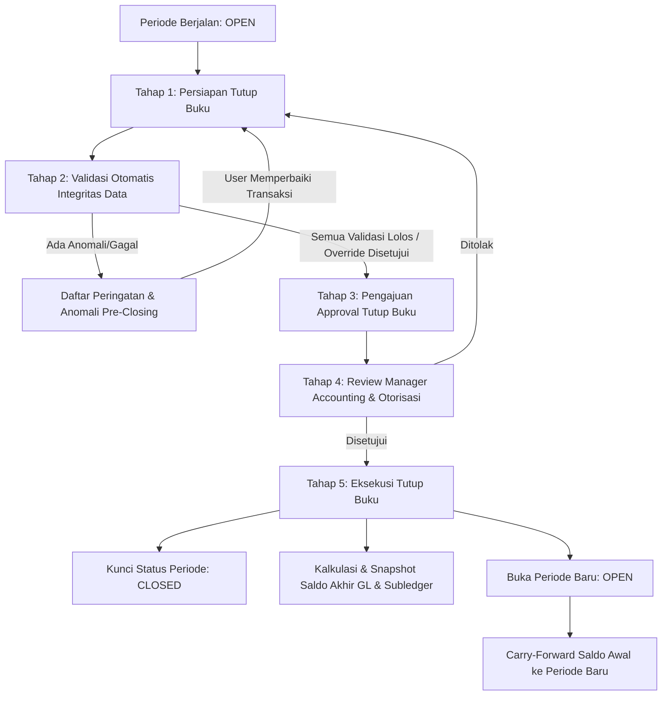
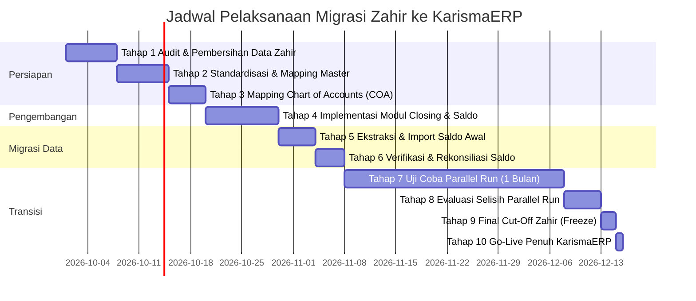
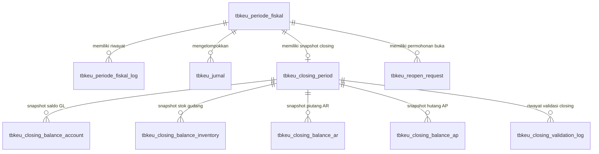

# BLUEPRINT MIGRASI ZAHIR ACCOUNTING KE KARISMAERP & DESAIN MODUL CUT-OFF / TUTUP BUKU

Dokumen ini disusun sebagai panduan strategis, arsitektur teknis, dan operasional menyeluruh untuk memindahkan seluruh proses akuntansi & operasional perusahaan dari **Zahir Accounting** ke sistem mandiri **KarismaERP**, serta perancangan mekanisme **Cut-Off / Tutup Buku (Closing Period)** dan **Migrasi Saldo Awal (Opening Balance)** yang persisten, aman, dan terintegrasi.

---

## 1. Kondisi KarismaERP Saat Ini

Berdasarkan audit komprehensif terhadap codebase dan database KarismaERP:

1. **Modul Operasional Sudah Sangat Kuat**:
   - **Sales & Distribusi**: Telah berjalan modul Sales Order (`tbso_sales_order`), Delivery Order (`tb_do`, `tb_detail_do`), Checker Keranjang (KK/LK), Faktur Penjualan (`tbso_faktur_penjualan`), dan Retur Penjualan Terintegrasi (`tbrp_spr_header`, `tbrp_retur_penjualan_header`).
   - **Purchasing & Logistik**: Telah berjalan Purchase Order (`tbpo_po`, `tbpo_detail_po`), Laporan Penerimaan Barang (`tb_lpb`, `tb_lpb_detail`), Adjustment Harga LPB, dan Retur Pembelian potong hutang (`tb_retur_pembelian`).
   - **Gudang & Stok**: Stock Ledger mutasi kuantitas (`tberp_stock_ledger`), penanganan batch/lot (`tberp_stock_batch`), mutasi antar gudang, dan aplikasi Stock Opname terpadu (`stockopname_opname`).
   - **Keuangan Operasional**: Kas Masuk, Kas Keluar, Kasir Harian (`tbkeu_transaksi_kasir`), Kasbon Karyawan berjenjang, dan alokasi pembayaran AR/AP (`tbkeu_pembayaran`, `tbkeu_pembayaran_alokasi`).

2. **Mesin Akuntansi (General Ledger) Sudah Memiliki Fondasi Modern**:
   - Jurnal berimbang berbasis akrual (`tbkeu_jurnal`, `tbkeu_jurnal_detail`) dengan *idempotency key* dan *lock versioning*.
   - Standar presisi angka moneter `DECIMAL(19,4)` tanpa *floating point error*.
   - Dynamic Mapping Akun (`tbkeu_mapping_akun`) sehingga logika posting terpisah dari *hardcoded* kode perkiraan.
   - Sifat jurnal `POSTED` yang *immutable* (tidak boleh sembarangan diedit/dihapus, koreksi wajib melalui *reversal*).
   - Fondasi tabel `tbkeu_periode_fiskal` dan `tbkeu_periode_fiskal_log` telah terbentuk di level basis data.

3. **Titik Lemah / Ketergantungan terhadap Zahir**:
   - KarismaERP selama ini sering diposisikan sebagai pencatat transaksi operasional lapangan (logistik & kasir), sedangkan neraca resmi, buku besar lengkap, laporan pajak, dan penilaian HPP persediaan akhir masih dihitung atau direkonsiliasi manual di Zahir.
   - Belum adanya **Mekanisme Otomasi Tutup Buku Periode (Monthly & Annual Closing)** yang mengkristalkan saldo akhir periode $N$ menjadi saldo awal periode $N+1$.
   - Belum adanya modul migrasi terstruktur untuk **Opening Balance Per Transaksi (Subledger Faktur Belum Lunas AR/AP & Rincian Stok per Lot/Gudang)**, melainkan baru sebatas konsep jurnal gelondongan.

---

## 2. Kekurangan yang Harus Dilengkapi

Sebelum Zahir dimatikan, KarismaERP harus melengkapi celah fungsi berikut:

1. **Subledger Cut-off Engine**: Kemampuan membekukan (*freeze*) dan mengunci buku pembantu piutang (Aging AR), buku pembantu hutang (Aging AP), dan buku persediaan (Inventory Ledger) per tanggal cut-off.
2. **Rekonsiliasi Otomatis (GL vs Subledger)**:
   - Total Saldo Akun Piutang di GL = $\sum$ Sisa Faktur Pelanggan di Subledger AR.
   - Total Saldo Akun Hutang di GL = $\sum$ Sisa Tagihan Supplier di Subledger AP.
   - Total Saldo Akun Persediaan di GL = $\sum$ (Qty $\times$ Nilai HPP) seluruh item di seluruh gudang.
3. **Penyusutan Aktiva Tetap (Fixed Assets & Depreciation)**: Modul pencatatan aset tetap, penentuan masa manfaat/metode garis lurus, dan penjurnalan depresiasi bulanan otomatis.
4. **Alokasi Selisih Kurs / Biaya Pembulatan**: Mekanisme penanganan selisih pembulatan rupiah dan biaya administrasi bank pada saat pelunasan piutang/hutang.
5. **Akrual Pajak (VAT & WHT Engine)**: Rekapitulasi Pajak Masukan (PPN Masukan LPB), Pajak Keluaran (PPN Keluaran Faktur Penjualan), PPh Pasal 23/21, dan integrasi penomoran e-Faktur.
6. **Mekanisme Reopen Berjenjang dengan Otoritas Khusus**: Alur audit formal jika manajemen memutuskan membuka kembali buku periode lampau.

---

## 3. Modul yang Wajib Tersedia

Berikut matriks kelengkapan modul wajib untuk menggantikan Zahir:

| Modul | Status di KarismaERP | Kebutuhan Penyesuaian agar Siap Gantikan Zahir |
| :--- | :--- | :--- |
| **Chart of Accounts (COA)** | Sudah Ada (`tbkeu_akun`) | Penyelarasan kode akun hierarki 100% identik dengan Zahir. |
| **Jurnal Umum & Auto-Posting** | Sudah Ada (`tbkeu_jurnal`) | Penambahan validasi pengecekan status periode sebelum query simpan dieksekusi. |
| **Buku Besar & Neraca Saldo** | Sudah Ada | Penambahan filter berbasis saldo carry forward dari tutup buku. |
| **Hutang Usaha (AP)** | Sudah Ada | Penambahan integrasi subledger faktur saldo awal Zahir. |
| **Piutang Usaha (AR)** | Sudah Ada | Penambahan integrasi subledger invoice saldo awal Zahir. |
| **Kartu Stok & HPP (Inventory)** | Sudah Ada | Perhitungan Moving Average Cost otomatis dari saldo awal + LPB. |
| **Kas & Bank** | Sudah Ada | Rekonsiliasi Bank bulanan (Rekening Koran vs Buku Kas/Bank KarismaERP). |
| **Pajak (Tax Summary)** | Parsial | Laporan SPT Masa PPN (Pajak Masukan vs Pajak Keluaran). |
| **Aktiva Tetap (Fixed Assets)** | Belum Ada | Modul register aset, kategori aset, dan jurnal otomatis beban penyusutan. |
| **Tutup Buku Bulanan (Monthly Closing)** | **Wajib Dibuat** | Mengunci transaksi, validasi integritas, carry forward saldo neraca ke bulan berikutnya. |
| **Tutup Buku Tahunan (Year-End Closing)** | **Wajib Dibuat** | Menutup akun Laba Rugi (Pendapatan & Beban) ke Akun *Laba Ditahan / Retained Earnings*. |
| **Migrasi Saldo Awal (Opening Balance)** | **Wajib Dibuat** | Form input/import CSV saldo awal GL, faktur hutang/piutang open, dan stok awal per gudang. |

---

## 4. Hubungan Antar Domain Akuntansi & Operasional ERP

Pemahaman alur terintegrasi sangat krusial agar tidak ada jurnal atau mutasi yang *orphan* (menggantung):

```
                        ┌──────────────────────────────┐
                        │   PENJUALAN (Sales Order)    │
                        └──────────────┬───────────────┘
                                       │ (Pengiriman Barang: DO)
                                       ▼
 ┌─────────────────────────────────────────────────────────────────────────────┐
 │  Faktur Penjualan (Billing):                                                │
 │  (D) Piutang Usaha (AR)                                                     │
 │      (K) Pendapatan Penjualan                                               │
 │      (K) Hutang PPN Keluaran                                                │
 │  Pengeluaran Barang (Goods Issue):                                          │
 │  (D) Harga Pokok Penjualan (HPP)                                            │
 │      (K) Persediaan Barang Dagang                                           │
 └──────────────────────┬──────────────────────────────────────────────────────┘
                        │
                        ├──────────────────────────┐
                        ▼                          ▼
             ┌─────────────────────┐    ┌─────────────────────┐
             │ Pelunasan Piutang   │    │  Retur Penjualan    │
             │ (D) Kas / Bank      │    │  (D) Retur Jual     │
             │     (K) Piutang AR  │    │  (D) PPN Keluaran   │
             └─────────────────────┘    │      (K) Piutang AR │
                                        │  (D) Persediaan     │
                                        │      (K) HPP        │
                                        └─────────────────────┘
```

```
                        ┌──────────────────────────────┐
                        │   PEMBELIAN (Purchase Order) │
                        └──────────────┬───────────────┘
                                       │ (Penerimaan Barang: LPB Gudang)
                                       ▼
 ┌─────────────────────────────────────────────────────────────────────────────┐
 │  Penerimaan Barang Fisik:                                                   │
 │  (D) Persediaan Barang Dagang (Akun Gudang)                                 │
 │      (K) Hutang Belum Ditagih / GRNI (Goods Received Not Invoiced)          │
 │  Faktur Pembelian Diverifikasi (LPB Final/Invoice Supplier):                │
 │  (D) Hutang Belum Ditagih / GRNI                                            │
 │  (D) PPN Masukan                                                            │
 │      (K) Hutang Usaha (AP Supplier)                                         │
 └──────────────────────┬──────────────────────────────────────────────────────┘
                        │
                        ├──────────────────────────┐
                        ▼                          ▼
             ┌─────────────────────┐    ┌─────────────────────┐
             │ Pembayaran Hutang   │    │  Retur Pembelian    │
             │ (D) Hutang AP       │    │  (D) Hutang AP      │
             │     (K) Kas / Bank  │    │      (K) Persediaan │
             └─────────────────────┘    │      (K) PPN Masuk  │
                                        └─────────────────────┘
```

```
                       ┌───────────────────────────────┐
                       │     GENERAL LEDGER (JURNAL)   │
                       └───────────────┬───────────────┘
                                       │
                      ┌────────────────┴────────────────┐
                      ▼                                 ▼
           ┌──────────────────────┐          ┌──────────────────────┐
           │     LABA RUGI        │          │        NERACA        │
           │  Pendapatan          │          │  Aktiva:             │
           │  (HPP)               │          │   - Kas & Bank       │
           │  (Beban Operasional) │          │   - Piutang Usaha    │
           │  (Beban Pajak/Lain)  │          │   - Persediaan       │
           │  ──────────────────  │          │   - Aktiva Tetap     │
           │  = LABA BERSIH       │          │  Kewajiban:          │
           └──────────┬───────────┘          │   - Hutang Usaha     │
                      │                      │   - Hutang Pajak     │
                      │                      │  Modal:              │
                      │                      │   - Modal Saham      │
                      │                      │   - Laba Ditahan     │
                      └─────────────────────►│   - Laba Berjalan    │
                         (Tutup Buku)        └──────────────────────┘
```

---

## 5. Analisis Risiko Transisi Tanpa Cut-Off dan Saldo Awal

Jika Zahir langsung dimatikan tanpa proses cut-off dan saldo awal yang terstruktur, perusahaan menghadapi risiko fatal:

1. **Hilangnya Akurasi Saldo Kas & Bank**:
   - Saldo rekening koran bank tidak akan cocok dengan saldo pembukuan di KarismaERP karena saldo per tanggal transisi tidak terdaftar.
2. **Kekacauan Nilai HPP dan Profitabilitas**:
   - Tanpa saldo awal nilai dan kuantitas persediaan, sistem tidak memiliki dasar harga pokok (*Cost Basis*). Seluruh penjualan barang lama akan menghasilkan HPP bernilai 0 (margin 100% palsu) atau HPP acak, merusak Laporan Laba Rugi.
3. **Piutang Macet Tak Tertagih**:
   - Faktur-faktur tempo dari Zahir yang belum lunas tidak terbaca di sistem penagihan KarismaERP. Bagian *Collection* tidak mengetahui customer mana yang memiliki piutang *overdue*.
4. **Gagal Rekonsiliasi Hutang Supplier**:
   - Supplier menagih pembayaran atas PO masa lalu, namun KarismaERP menolak pencatatan pembayaran karena tidak ada nomor faktur penerimaan (LPB) terkait di database.
5. **Jurnal Backdating Merusak Audit**:
   - User operasional leluasa menginput transaksi mundur ke bulan-bulan lampau, sehingga laporan keuangan yang sudah dilaporkan ke Direksi/Pajak berubah tanpa jejak (*audit trail break*).

---

## 6. Desain Modul Cut-Off / Tutup Buku (Closing Period)

### A. Periode Tutup Buku yang Direkomendasikan
Sistem ERP wajib menerapkan arsitektur **Kombinasi Tutup Buku Bulanan (Monthly Closing) dan Tutup Buku Tahunan (Year-End Closing)**:
- **Tutup Buku Bulanan (Tiap Akhir Bulan Kalender)**:
  - *Alasan*: Perusahaan membutuhkan laporan performa laba rugi bulanan, pelaporan SPT Masa Pajak PPN/PPh, serta kepastian saldo piutang dan stok akhir bulan untuk manajemen.
  - *Mekanisme*: Mengunci tanggal transaksi pada bulan tersebut, memvalidasi integritas GL vs Subledger, dan menghitung saldo akhir bulan untuk dijadikan saldo awal (*opening balance*) bulan berikutnya secara *carry-forward*.
- **Tutup Buku Tahunan (Tiap 31 Desember)**:
  - *Alasan*: Penutupan tahun buku fiskal resmi perusahaan.
  - *Mekanisme*: Selain mengunci periode Desember, sistem mengeksekusi **Jurnal Penutup (Closing Entries)**:
    - Menutup seluruh akun Pendapatan (Akun Kelas 4 & 7) ke posisi Debit.
    - Menutup seluruh akun HPP dan Beban (Akun Kelas 5, 6, 8, 9) ke posisi Kredit.
    - Memindahkan selisih laba/rugi bersih tahun berjalan ke akun ekuitas: **Laba Ditahan / Retained Earnings (Akun 3-20000)**.
    - Akun nominal (Pendapatan & Beban) pada 1 Januari tahun berikutnya otomatis berawal dari nol, sedangkan akun riil (Neraca) membawa saldo akhir tahun sebelumnya.

### B. Prinsip Utama: TIDAK ADA PENGOSONGAN DATA
> [!IMPORTANT]
> **Tutup buku dalam sistem modern BUKAN berarti menghapus atau mengosongkan data transaksi lama.**
> Tutup buku adalah mekanisme **mengubah status periode menjadi `CLOSED` (Terkunci/Immutable)**. Seluruh data transaksi, mutasi stok, jurnal, dan faktur tetap tersimpan permanen di database MariaDB. User tetap dapat melihat histori transaksi, mencetak faktur lama, dan menarik laporan keuangan periode lampau kapan saja.

### C. Alur Kerja Tutup Buku (Closing Workflow)



### D. Checklist Validasi Pra-Tutup Buku (Pre-Closing Validation)
Sistem KarismaERP akan menolak proses tutup buku jika salah satu kondisi berikut belum terpenuhi:

1. **Jurnal & GL**:
   - Tidak ada jurnal berstatus `DRAFT` pada periode tersebut.
   - Tidak ada antrean `tbkeu_posting_exception` yang masih `OPEN`.
   - Seluruh jurnal `POSTED` dalam kondisi seimbang (Debit = Kredit) dan tidak ada baris tanpa akun.
2. **Sales & Piutang (AR)**:
   - Tidak ada Delivery Order (DO) berstatus menggantung yang belum terbit Faktur Penjualan.
   - Seluruh retur penjualan (`tbrp_spr_header`) telah terverifikasi atau dibatalkan resmi.
   - Total Saldo Akun Piutang di Buku Besar = Total Sisa Piutang pada Laporan Aging AR.
3. **Purchasing & Hutang (AP)**:
   - Seluruh LPB yang diterima fisik gudang telah diverifikasi harga atau dicatat akrual hutangnya (tidak ada LPB gantung tanpa kejelasan).
   - Seluruh retur pembelian telah diproses potong hutang atau kas.
   - Total Saldo Akun Hutang di Buku Besar = Total Sisa Hutang pada Laporan Aging AP.
4. **Gudang & Persediaan (Inventory)**:
   - Tidak ada mutasi antar gudang yang masih berstatus `IN_TRANSIT`.
   - Tidak ada kuantitas stok bernilai **negatif** pada gudang manapun.
   - Rekonsiliasi Stock Opname periode berjalan telah disetujui (*affirmed*).
   - Total Nilai Persediaan di Buku Besar = Total Nilai Fisik Persediaan ($\sum Qty \times HPP$).
5. **Kas & Bank**:
   - Seluruh transaksi kasir harian telah berstatus setor/tutup shift kasir.
   - Rekonsiliasi bank (pencocokan mutasi rekening koran) telah selesai diverifikasi.

### E. Mekanisme Pencegahan Perubahan Transaksi Terkunci
1. **Di Level Controller/Application**:
   - Setiap kali *save*, *update*, *delete*, *void*, atau *repost* dipanggil, sistem memanggil fungsi `Accounting_service::assert_period_is_open($transactionDate)`.
   - Jika tanggal transaksi jatuh pada periode yang berstatus `CLOSED`, sistem langsung melempar *HTTP 422 Unprocessable Entity / Exception* dengan pesan: *"Periode akuntansi untuk tanggal tersebut telah ditutup. Transaksi tidak dapat diubah."*
2. **Di Level Antarmuka (UI/Views)**:
   - Tombol *Edit*, *Hapus*, *Batal*, dan *Tambah Transaksi* otomatis dinonaktifkan (*disabled/hidden*) jika tanggal transaksi masuk ke periode tertutup.
   - Diberikan *badge* visual berwarna abu-abu/merah: `TERKUNCI (CLOSED)`.
3. **Di Level Basis Data (Database Trigger - Pertahanan Berlapis)**:
   - Trigger MySQL/MariaDB pada tabel inti (`tbkeu_jurnal`, `tbso_faktur_penjualan`, `tb_lpb`, dll.) yang memblokir instruksi `UPDATE` atau `DELETE` jika tanggal transaksi berada di rentang tanggal periode yang berstatus `CLOSED`.

### F. Mekanisme Koreksi, Jurnal Penyesuaian, dan Reopen Periode
Jika setelah periode ditutup ditemukan kesalahan materiil, ada dua jalur resmi sesuai prinsip akuntansi standar internasional:

1. **Jalur Utama (Sangat Disarankan): Jurnal Penyesuaian di Periode Aktif**
   - Periode lampau **tetap terkunci**.
   - Kesalahan dikoreksi dengan menerbitkan **Jurnal Penyesuaian (Adjustment Journal)** atau memo koreksi pada tanggal hari ini di periode yang sedang aktif.
   - Laporan keuangan periode lampau yang sudah diaudit tidak berubah, dan koreksi tercermin di periode berjalan.
2. **Jalur Khusus: Reopen Periode (Audit Exception Mode)**
   - Jika mutlak harus mengubah data periode lampau (misal sebelum pelaporan pajak tahunan resmi dikirim):
     - **Pengajuan Reopen**: Staff Accounting mengajukan formulir permohonan buka periode (`tbkeu_reopen_request`) disertai alasan audit yang kuat dan bukti lampiran.
     - **Approval Multi-Tingkat**: Membutuhkan persetujuan **Manager Accounting + Direktur Utama**.
     - **Status Khusus `REOPENED_AUDIT`**: Periode terbuka secara terbatas (hanya user dengan wewenang khusus yang dapat mengedit).
     - **Audit Trail Ketat**: Seluruh aktivitas perubahan selama reopen dicatat dalam log khusus (`tbkeu_periode_fiskal_log` & `tb_editlog_transaksi`).
     - **Wajib Tutup Kembali**: Setelah koreksi selesai, sistem mewajibkan tutup buku ulang (*re-closing*) untuk memperbarui saldo carry forward ke bulan-bulan berikutnya.

---

## 7. Analisis Migrasi Saldo Awal dari Zahir

### Mengapa Jurnal Saldo Awal Gelondongan Saja TIDAK CUKUP?
Banyak kegagalan implementasi ERP terjadi karena saldo awal hanya dimasukkan sebagai 1 lembar **Jurnal Memorial Saldo Awal** di GL.
- Jika Piutang dimasukkan gelondongan `Rp 2.000.000.000`, maka di General Ledger angkanya benar, namun ketika pelanggan membayar via transfer bank, kasir tidak dapat memilih nomor faktur mana yang dilunasi!
- Jika Hutang dimasukkan gelondongan `Rp 1.500.000.000`, tim purchasing tidak tahu jatuh tempo faktur supplier mana yang harus dibayar minggu depan.
- Jika Persediaan dimasukkan gelondongan `Rp 5.000.000.000`, sistem gudang tidak tahu stok barang mana yang ada di gudang, berapa kuantitasnya, dan berapa HPP per unitnya.

**Solusi Standar KarismaERP**:
Saldo awal wajib dimigrasikan dalam 2 layer yang saling mengunci:
1. **Layer 1: Jurnal Saldo Awal Akuntansi (General Ledger)**.
2. **Layer 2: Saldo Awal Subledger Per Transaksi (Open Balance Details)**:
   - **Subledger AR**: Rincian per faktur penjualan belum lunas per customer (Nomor Faktur Zahir, Tanggal Faktur, Total Nilai, Sisa Saldo Piutang, Jatuh Tempo).
   - **Subledger AP**: Rincian per tagihan belum lunas per supplier (Nomor Invoice Supplier, Tanggal, Sisa Hutang, Jatuh Tempo).
   - **Subledger Persediaan**: Rincian per item per gudang (Kode Barang, Qty Fisik, Satuan, Nilai Rupiah Total, HPP Satuan, Lot/Batch & Expired Date jika ada).
   - **Subledger Kas/Bank**: Saldo per rekening bank dan kas kecil.

### Rekonsiliasi Saldo Awal
Sebelum transaksi live di KarismaERP dibuka, sistem menjalankan *Self-Balancing Test*:
$$\sum \text{Detail Saldo Awal AR} = \text{Saldo Akun Piutang di Jurnal Saldo Awal}$$
$$\sum \text{Detail Saldo Awal AP} = \text{Saldo Akun Hutang di Jurnal Saldo Awal}$$
$$\sum \text{Detail Saldo Awal Stok} = \text{Saldo Akun Persediaan di Jurnal Saldo Awal}$$
$$\sum \text{Total Debit Saldo Awal GL} = \sum \text{Total Kredit Saldo Awal GL}$$

---

## 8. Rencana 10 Tahap Migrasi Zahir ke KarismaERP

Berikut rancangan jadwal dan tahapan migrasi yang aman:



### Rincian Tiap Tahap:
1. **Tahap 1 — Audit & Pembersihan Data Zahir**:
   - Menghapus akun-akun ganda di Zahir, menyelesaikan transaksi menggantung, mengeliminasi barang non-aktif atau pelanggan fiktif.
2. **Tahap 2 — Mapping Master Data**:
   - Penyelarasan Kode Customer, Kode Supplier, dan Master Barang (termasuk konversi satuan eceran/karton).
3. **Tahap 3 — Mapping Chart of Accounts (COA)**:
   - Pemetaan 501 kode rekening Zahir ke `tbkeu_akun` KarismaERP dan konfigurasi rule laporan di `tbkeu_mapping_akun`.
4. **Tahap 4 — Pembangunan Fitur Closing & Opening Balance di KarismaERP**:
   - Menyiapkan tabel `tbkeu_closing_period`, form opening balance subledger, dan service validasi tutup buku.
5. **Tahap 5 — Migrasi Saldo Awal (Cut-Off Awal)**:
   - Memasukkan saldo neraca per tanggal cut-off, saldo faktur AR/AP open, dan kuantitas serta nilai stok per gudang.
6. **Tahap 6 — Rekonsiliasi Saldo Awal**:
   - Menandatangani Berita Acara Rekonsiliasi Saldo Awal antara Tim Finance & Direksi.
7. **Tahap 7 — Parallel Run (Uji Coba Berdampingan)**:
   - Operasional harian diinput ganda di Zahir dan KarismaERP selama 1 periode kalender (minimal 30 hari).
8. **Tahap 8 — Evaluasi Selisih (*Variance Analysis*)**:
   - Membandingkan laporan mingguan & bulanan KarismaERP vs Zahir. Mencari tahu penyebab selisih (jika ada pembulatan atau selisih timing).
9. **Tahap 9 — Final Cut-Off Zahir**:
   - Zahir dialihkan menjadi mode *Read-Only* (tidak boleh ada input transaksi baru lagi di Zahir).
10. **Tahap 10 — Go Live KarismaERP Sebagai Sistem Tunggal**:
    - KarismaERP beroperasi penuh 100% untuk seluruh divisi.

---

## 9. Mekanisme Parallel Run

### A. Durasi yang Ideal
- **Rekomendasi Terbaik**: **1 Bulan Penuh (1 Periode Akuntansi Penuh)**, misalnya dari tanggal 1 hingga 30/31 pada bulan berjalan.
- *Alasan*: Parallel run selama 1 bulan mencakup siklus akuntansi lengkap: transaksi harian, penggajian, penagihan tempo mingguan/bulanan, pelaporan pajak masa, hingga proses **Tutup Buku Akhir Bulan**. Menjalankan parallel run terlalu lama (> 3 bulan) akan membebani staf (*double entry fatigue*), sedangkan terlalu singkat (< 2 minggu) tidak menguji siklus akhir bulan.

### B. Daftar Laporan yang Wajib Direkonsiliasi Setiap Minggu

| No | Laporan yang Dibandingkan | Toleransi Selisih | Tindakan Jika Terjadi Selisih |
| :---: | :--- | :---: | :--- |
| 1 | **Neraca (Balance Sheet)** | Rp 0 | Audit mutasi per klasifikasi akun aktiva, kewajiban, ekuitas. |
| 2 | **Laba Rugi (Income Statement)** | Rp 0 | Cek akun pengakuan penjualan, HPP barang, dan beban operasional. |
| 3 | **Buku Besar Kas & Bank** | Rp 0 | Cek voucher kas masuk/keluar harian dan mutasi bank. |
| 4 | **Daftar Sisa Piutang (Aging AR)** | Rp 0 | Cek apakah ada invoice yang lupa teralokasi pembayaran atau retur. |
| 5 | **Daftar Sisa Hutang (Aging AP)** | Rp 0 | Cek faktur LPB supplier dan potongan nota retur pembelian. |
| 6 | **Nilai Persediaan & HPP** | < 0.01% (Pembulatan) | Analisis metode moving average vs pembulatan unit di Zahir. |
| 7 | **Rekap Pajak (PPN Masukan/Keluaran)** | Rp 0 | Cocokkan DPP dan nilai PPN Faktur Pajak standar. |

---

## 10. Rancangan Database Teknis KarismaERP

Untuk mendukung mekanisme Tutup Buku dan Saldo Awal yang persisten, aman, dan dapat diaudit, berikut rancangan struktur tabel baru yang selaras dengan konvensi penamaan KarismaERP (`tbkeu_`):



### Skema DDL SQL Spesifik:

```sql
-- 1. Penambahan Kolom Status Khusus pada tbkeu_periode_fiskal (jika belum ada)
ALTER TABLE `tbkeu_periode_fiskal`
  ADD COLUMN IF NOT EXISTS `tipe_periode` ENUM('MONTHLY','YEAR_END') NOT NULL DEFAULT 'MONTHLY' AFTER `nama_periode`,
  ADD COLUMN IF NOT EXISTS `is_closing_locked` TINYINT(1) NOT NULL DEFAULT 0 AFTER `status`,
  ADD COLUMN IF NOT EXISTS `closed_at` DATETIME DEFAULT NULL AFTER `is_closing_locked`,
  ADD COLUMN IF NOT EXISTS `closed_by` BIGINT DEFAULT NULL AFTER `closed_at`,
  ADD COLUMN IF NOT EXISTS `reopened_at` DATETIME DEFAULT NULL AFTER `closed_by`,
  ADD COLUMN IF NOT EXISTS `reopened_by` BIGINT DEFAULT NULL AFTER `reopened_at`;

-- 2. Tabel Header Snapshot Tutup Buku (Closing Header)
CREATE TABLE IF NOT EXISTS `tbkeu_closing_period` (
  `id_closing` BIGINT UNSIGNED NOT NULL AUTO_INCREMENT,
  `id_periode` BIGINT UNSIGNED NOT NULL,
  `kode_periode` VARCHAR(20) NOT NULL,
  `tipe_closing` ENUM('BULANAN','TAHUNAN') NOT NULL DEFAULT 'BULANAN',
  `tanggal_closing` DATE NOT NULL,
  `waktu_eksekusi` DATETIME NOT NULL DEFAULT CURRENT_TIMESTAMP,
  `eksekutor_user_id` BIGINT NOT NULL,
  `approved_by` BIGINT DEFAULT NULL,
  `approved_at` DATETIME DEFAULT NULL,
  `total_debit_gl` DECIMAL(19,4) NOT NULL DEFAULT 0.0000,
  `total_kredit_gl` DECIMAL(19,4) NOT NULL DEFAULT 0.0000,
  `total_laba_bersih_periode` DECIMAL(19,4) NOT NULL DEFAULT 0.0000,
  `total_nilai_persediaan` DECIMAL(19,4) NOT NULL DEFAULT 0.0000,
  `total_piutang_berjalan` DECIMAL(19,4) NOT NULL DEFAULT 0.0000,
  `total_hutang_berjalan` DECIMAL(19,4) NOT NULL DEFAULT 0.0000,
  `status` ENUM('COMPLETED','REOPENED_ROLLBACK') NOT NULL DEFAULT 'COMPLETED',
  `catatan` TEXT DEFAULT NULL,
  `created_at` DATETIME DEFAULT CURRENT_TIMESTAMP,
  PRIMARY KEY (`id_closing`),
  UNIQUE KEY `uk_closing_periode` (`id_periode`),
  KEY `idx_closing_tanggal` (`tanggal_closing`),
  CONSTRAINT `fk_closing_periode` FOREIGN KEY (`id_periode`) 
    REFERENCES `tbkeu_periode_fiskal` (`id_periode`) ON UPDATE CASCADE
) ENGINE=InnoDB DEFAULT CHARSET=utf8mb4 COLLATE=utf8mb4_general_ci;

-- 3. Snapshot Saldo Akhir GL per Akun (Buku Besar Frozen)
CREATE TABLE IF NOT EXISTS `tbkeu_closing_balance_account` (
  `id_closing_acc` BIGINT UNSIGNED NOT NULL AUTO_INCREMENT,
  `id_closing` BIGINT UNSIGNED NOT NULL,
  `id_akun` BIGINT UNSIGNED NOT NULL,
  `saldo_awal` DECIMAL(19,4) NOT NULL DEFAULT 0.0000,
  `mutasi_debit` DECIMAL(19,4) NOT NULL DEFAULT 0.0000,
  `mutasi_kredit` DECIMAL(19,4) NOT NULL DEFAULT 0.0000,
  `saldo_akhir` DECIMAL(19,4) NOT NULL DEFAULT 0.0000,
  `posisi_saldo_normal` ENUM('DEBIT','KREDIT') NOT NULL,
  PRIMARY KEY (`id_closing_acc`),
  UNIQUE KEY `uk_closing_akun` (`id_closing`, `id_akun`),
  KEY `idx_closing_acc_akun` (`id_akun`),
  CONSTRAINT `fk_closing_acc_header` FOREIGN KEY (`id_closing`) 
    REFERENCES `tbkeu_closing_period` (`id_closing`) ON DELETE CASCADE ON UPDATE CASCADE,
  CONSTRAINT `fk_closing_acc_akun` FOREIGN KEY (`id_akun`) 
    REFERENCES `tbkeu_akun` (`id_akun`) ON UPDATE CASCADE
) ENGINE=InnoDB DEFAULT CHARSET=utf8mb4 COLLATE=utf8mb4_general_ci;

-- 4. Snapshot Persediaan Akhir per Gudang dan Item (Inventory Frozen)
CREATE TABLE IF NOT EXISTS `tbkeu_closing_balance_inventory` (
  `id_closing_inv` BIGINT UNSIGNED NOT NULL AUTO_INCREMENT,
  `id_closing` BIGINT UNSIGNED NOT NULL,
  `id_barang` BIGINT NOT NULL,
  `id_gudang` BIGINT NOT NULL,
  `qty_akhir` DECIMAL(19,4) NOT NULL DEFAULT 0.0000,
  `hpp_rata_rata` DECIMAL(19,4) NOT NULL DEFAULT 0.0000,
  `total_nilai_stok` DECIMAL(19,4) NOT NULL DEFAULT 0.0000,
  PRIMARY KEY (`id_closing_inv`),
  KEY `idx_closing_inv_header` (`id_closing`),
  KEY `idx_closing_inv_barang` (`id_barang`),
  CONSTRAINT `fk_closing_inv_header` FOREIGN KEY (`id_closing`) 
    REFERENCES `tbkeu_closing_period` (`id_closing`) ON DELETE CASCADE ON UPDATE CASCADE
) ENGINE=InnoDB DEFAULT CHARSET=utf8mb4 COLLATE=utf8mb4_general_ci;

-- 5. Log Validasi Pra-Tutup Buku
CREATE TABLE IF NOT EXISTS `tbkeu_closing_validation_log` (
  `id_val_log` BIGINT UNSIGNED NOT NULL AUTO_INCREMENT,
  `id_periode` BIGINT UNSIGNED NOT NULL,
  `tipe_pemeriksaan` VARCHAR(50) NOT NULL, -- e.g. DRAFT_JOURNAL, NEGATIVE_STOCK, UNBALANCED_GL
  `tingkat_keparahan` ENUM('BLOCKING','WARNING','INFO') NOT NULL DEFAULT 'BLOCKING',
  `status` ENUM('PASSED','FAILED') NOT NULL,
  `deskripsi` VARCHAR(255) NOT NULL,
  `jumlah_anomali` INT UNSIGNED NOT NULL DEFAULT 0,
  `data_referensi` LONGTEXT DEFAULT NULL,
  `diperiksa_pada` DATETIME DEFAULT CURRENT_TIMESTAMP,
  PRIMARY KEY (`id_val_log`),
  KEY `idx_closing_val_periode` (`id_periode`)
) ENGINE=InnoDB DEFAULT CHARSET=utf8mb4 COLLATE=utf8mb4_general_ci;

-- 6. Tabel Permohonan & Otorisasi Buka Periode (Reopen Request)
CREATE TABLE IF NOT EXISTS `tbkeu_reopen_request` (
  `id_reopen` BIGINT UNSIGNED NOT NULL AUTO_INCREMENT,
  `id_periode` BIGINT UNSIGNED NOT NULL,
  `alasan_pembukaan` TEXT NOT NULL,
  `diajukan_oleh` BIGINT NOT NULL,
  `diajukan_pada` DATETIME DEFAULT CURRENT_TIMESTAMP,
  `disetujui_manager_by` BIGINT DEFAULT NULL,
  `disetujui_manager_at` DATETIME DEFAULT NULL,
  `disetujui_direktur_by` BIGINT DEFAULT NULL,
  `disetujui_direktur_at` DATETIME DEFAULT NULL,
  `status_approval` ENUM('PENDING','APPROVED','REJECTED') NOT NULL DEFAULT 'PENDING',
  `batas_waktu_reopen` DATETIME DEFAULT NULL,
  `catatan_koreksi` TEXT DEFAULT NULL,
  PRIMARY KEY (`id_reopen`),
  KEY `idx_reopen_periode` (`id_periode`),
  CONSTRAINT `fk_reopen_periode` FOREIGN KEY (`id_periode`) 
    REFERENCES `tbkeu_periode_fiskal` (`id_periode`) ON UPDATE CASCADE
) ENGINE=InnoDB DEFAULT CHARSET=utf8mb4 COLLATE=utf8mb4_general_ci;

-- 7. Tabel Migrasi Subledger Saldo Awal Faktur Piutang (Open AR Invoices Zahir)
CREATE TABLE IF NOT EXISTS `tbkeu_saldo_awal_ar` (
  `id_saldo_ar` BIGINT UNSIGNED NOT NULL AUTO_INCREMENT,
  `id_customer` BIGINT NOT NULL,
  `nomor_faktur_zahir` VARCHAR(100) NOT NULL,
  `tanggal_faktur` DATE NOT NULL,
  `tanggal_jatuh_tempo` DATE NOT NULL,
  `nilai_faktur` DECIMAL(19,4) NOT NULL DEFAULT 0.0000,
  `sudah_dibayar` DECIMAL(19,4) NOT NULL DEFAULT 0.0000,
  `sisa_piutang` DECIMAL(19,4) NOT NULL DEFAULT 0.0000,
  `keterangan` VARCHAR(255) DEFAULT NULL,
  `is_applied_to_gl` TINYINT(1) NOT NULL DEFAULT 0,
  `created_at` DATETIME DEFAULT CURRENT_TIMESTAMP,
  PRIMARY KEY (`id_saldo_ar`),
  UNIQUE KEY `uk_saldo_ar_faktur` (`nomor_faktur_zahir`),
  KEY `idx_saldo_ar_cust` (`id_customer`)
) ENGINE=InnoDB DEFAULT CHARSET=utf8mb4 COLLATE=utf8mb4_general_ci;

-- 8. Tabel Migrasi Subledger Saldo Awal Faktur Hutang (Open AP Bills Zahir)
CREATE TABLE IF NOT EXISTS `tbkeu_saldo_awal_ap` (
  `id_saldo_ap` BIGINT UNSIGNED NOT NULL AUTO_INCREMENT,
  `id_supplier` BIGINT NOT NULL,
  `nomor_faktur_zahir` VARCHAR(100) NOT NULL,
  `tanggal_faktur` DATE NOT NULL,
  `tanggal_jatuh_tempo` DATE NOT NULL,
  `nilai_faktur` DECIMAL(19,4) NOT NULL DEFAULT 0.0000,
  `sudah_dibayar` DECIMAL(19,4) NOT NULL DEFAULT 0.0000,
  `sisa_hutang` DECIMAL(19,4) NOT NULL DEFAULT 0.0000,
  `keterangan` VARCHAR(255) DEFAULT NULL,
  `is_applied_to_gl` TINYINT(1) NOT NULL DEFAULT 0,
  `created_at` DATETIME DEFAULT CURRENT_TIMESTAMP,
  PRIMARY KEY (`id_saldo_ap`),
  UNIQUE KEY `uk_saldo_ap_faktur` (`nomor_faktur_zahir`),
  KEY `idx_saldo_ap_supp` (`id_supplier`)
) ENGINE=InnoDB DEFAULT CHARSET=utf8mb4 COLLATE=utf8mb4_general_ci;

-- 9. Tabel Migrasi Subledger Saldo Awal Persediaan per Gudang (Open Stock Zahir)
CREATE TABLE IF NOT EXISTS `tbkeu_saldo_awal_persediaan` (
  `id_saldo_inv` BIGINT UNSIGNED NOT NULL AUTO_INCREMENT,
  `id_barang` BIGINT NOT NULL,
  `id_gudang` BIGINT NOT NULL,
  `batch_no` VARCHAR(100) DEFAULT '-',
  `expired_date` DATE DEFAULT NULL,
  `qty_stok` DECIMAL(19,4) NOT NULL DEFAULT 0.0000,
  `hpp_satuan` DECIMAL(19,4) NOT NULL DEFAULT 0.0000,
  `total_nilai` DECIMAL(19,4) NOT NULL DEFAULT 0.0000,
  `is_applied_to_gl` TINYINT(1) NOT NULL DEFAULT 0,
  `created_at` DATETIME DEFAULT CURRENT_TIMESTAMP,
  PRIMARY KEY (`id_saldo_inv`),
  KEY `idx_saldo_inv_barang` (`id_barang`),
  KEY `idx_saldo_inv_gudang` (`id_gudang`)
) ENGINE=InnoDB DEFAULT CHARSET=utf8mb4 COLLATE=utf8mb4_general_ci;
```

---

## 11. Rancangan Hak Akses & Keamanan (Role & Permission Matrix)

Untuk mencegah kecurangan, kesalahan operasional, atau pengeditan data di luar wewenang:

| Tindakan / Aksi | Staff Accounting | SPV / Kasir | Manager Accounting | Direktur | Admin IT |
| :--- | :---: | :---: | :---: | :---: | :---: |
| **Entri Transaksi Harian** (Periode OPEN) | V | V | V | - | - |
| **Jurnal Penyesuaian Manual** | V | - | V | - | - |
| **Menjalankan Cek Validasi Pre-Closing** | V | - | V | V | V |
| **Mengajukan Tutup Buku Bulanan/Tahunan** | V | - | V | - | - |
| **Approval Tutup Buku Bulanan** | - | - | **V** | V | - |
| **Approval Tutup Buku Tahunan** | - | - | V | **V (Final)** | - |
| **Mengajukan Permohonan Buka Periode (Reopen)** | V | - | V | - | - |
| **Approval Buka Periode (Reopen)** | - | - | **V (Tahap 1)** | **V (Final)** | - |
| **Edit/Hapus Transaksi pada Periode CLOSED** | **DITOLAK** | **DITOLAK** | **DITOLAK** | **DITOLAK** | **DITOLAK** |
| **Lihat & Cetak Laporan Historis Periode CLOSED** | V | V | V | V | V |

> [!CAUTION]
> **Aturan Mutlak Keamanan**: Admin IT sekalipun **TIDAK DIIZINKAN** memiliki tombol "Edit Bebas" pada transaksi di periode `CLOSED`. Semua perubahan wajib melalui pintu resmi `tbkeu_reopen_request` atau membuat jurnal pembalik/penyesuaian baru agar integritas jejak audit (*forensic audit trail*) tetap terjamin 100%.

---

## 12. Rekomendasi Checklist Kesiapan Go-Live

Sebelum kabel sistem Zahir benar-benar dicabut:

- [ ] **Audit Master Data**: Seluruh pelanggan, supplier, barang, dan COA di KarismaERP telah terverifikasi identik dengan Zahir.
- [ ] **Validasi Saldo Awal GL**: Jurnal Saldo Awal Debit = Kredit dan Neraca Saldo Awal sama persis dengan Neraca Akhir Zahir per tanggal cut-off.
- [ ] **Validasi Subledger AR**: Total sisa piutang per faktur customer di KarismaERP = Saldo Akun Piutang di GL.
- [ ] **Validasi Subledger AP**: Total sisa hutang per faktur supplier di KarismaERP = Saldo Akun Hutang di GL.
- [ ] **Validasi Subledger Stok**: Total nilai rupiah persediaan di seluruh gudang KarismaERP = Saldo Akun Persediaan di GL.
- [ ] **Uji Coba Parallel Run**: Telah dilaksanakan parallel run minimal 1 periode bulanan tanpa ada selisih yang tak terjelaskan.
- [ ] **Uji Coba Tutup Buku**: Tim accounting telah berhasil melakukan simulasi Tutup Buku Bulanan dan Tutup Buku Tahunan di environment staging/trial.
- [ ] **Uji Coba Proteksi Periode**: Dipastikan staf kasir/sales/purchasing tidak dapat menyimpan transaksi tanggal mundur yang jatuh pada periode terkunci.
- [ ] **Backup Database Master**: Backup penuh database MariaDB (`mysqldump`) telah disimpan di lokasi penyimpanan aman (cold storage/cloud).
- [ ] **Sign-Off Eksekutif**: Berita Acara Migrasi dan Penghentian Zahir ditandatangani oleh Manager Finance, Kadep IT, dan Direktur Utama.

---
Dokumen ini menjadi acuan baku bagi seluruh tim pengembang KarismaERP dalam membangun sistem ERP yang tangguh, terpercaya, dan siap menopang pertumbuhan perusahaan secara mandiri.
