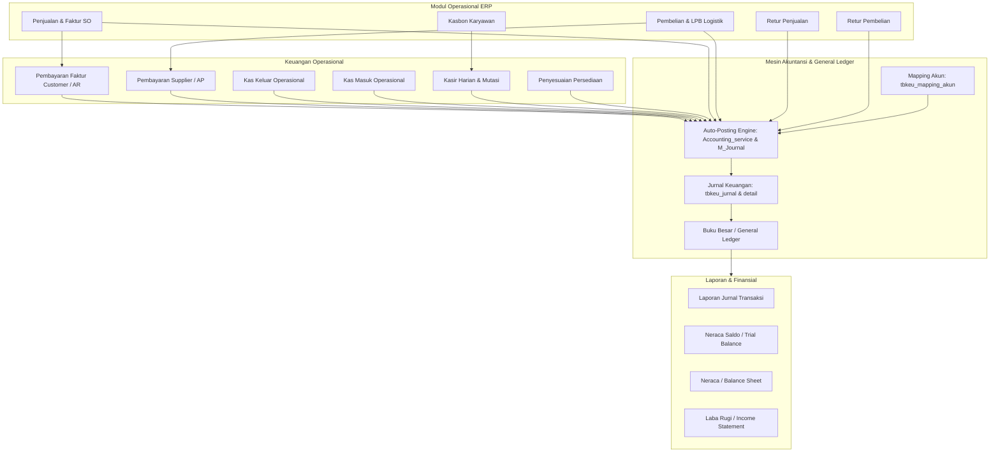

# Daftar & Analisis Modul Sistem — KARISMA ERP

Dokumen ini menyajikan rincian lengkap mengenai:
1. **Daftar Modul Besar Setiap Departemen** di KARISMA ERP (Sales, Purchasing, Logistik, Keuangan, HRD, dsb.).
2. **Analisis Mendalam Arsitektur & Modul Keuangan (Finance & Accounting)**.

---

# BAGIAN I — DAFTAR MODUL BESAR SETIAP DEPARTEMEN

Berikut adalah pembagian modul-modul fungsional utama berdasarkan departemen kerja pada sistem KARISMA ERP:

### Sales :
- Sales Order (SO)
- SO Lobby & Penentuan Rute Kirim
- Approval Limit Piutang / Overdue (OD)
- Approval Edit Harga & Pembatalan Parsial SO
- Stok Online & Katalog Produk
- **Retur Penjualan** :
  * Pengajuan Surat Permohonan Retur (SPR) Sales
  * Alur Approval Berjenjang (Manager SC, Kadep UB/Jagung, Admin Retur, Kadep SC, Logistik)
  * Pembuatan Dokumen Resmi Retur Penjualan (ADMLPB2)
  * Pilihan Tipe Retur (Biasa/Potong Faktur, Replace/Ganti Barang, Service/Perbaikan)
  * Checklist Alasan Retur (Barang Rusak, Expired, Tidak Laku, Tes Market, Bad Debt, Salah Harga, dsb.)
  * Verifikasi Admin Stock & Alokasi Gudang/Lot
  * Verifikasi Collection (Kompensasi Potong Faktur Piutang)
  * Verifikasi Kasir (Pengembalian Kas/Tunai)
  * Auto-Posting Jurnal Akuntansi (Retur, PPN, Reversal Stok & HPP vs Piutang)
  * Cetak Dokumen SPR & Nota Retur Penjualan
  * Audit Activity Log & Notifikasi Pending
- Laporan Sales, Tonase & Kubikasi

### Purchasing :
- Data PO & Monitoring LPB
- Detail LPB (Verifikasi Harga, Faktur Pajak, Pecah Invoice)
- Input LPB Manual
- Laporan LPB (Hybrid PO & Manual)
- Request Paket Bundling & Formula Bundling
- **Retur Pembelian** :
  * Pemilihan Referensi LPB Final Terverifikasi
  * Pembuatan Draft Retur Pembelian (Qty, Batch/Lot, Expired Date, Alasan)
  * Kalkulasi Otomatis DPP, PPN, dan Grand Total Retur
  * Pilihan Jenis Penyelesaian (Potong Hutang, Cash Refund, Replacement)
  * Alur Verifikasi Bertingkat (Purchasing Verified & Accounting Verified)
  * Monitoring Persiapan Fisik Gudang (Belum, Sedang, Sudah Disiapkan, Selesai)
  * Pengurangan Stok Fisik Gudang & Pencatatan Kartu Stok Ledger (`RBELI`)
  * Integrasi Potong Hutang Supplier pada Modul Pembayaran Supplier (AP)
  * Auto-Posting Jurnal Akuntansi (Hutang/Piutang Retur vs Persediaan & PPN Masukan)
  * Pembatalan Dokumen (Void) dengan Reversal Jurnal & Pengembalian Stok Otomatis
- Adjustment Harga LPB
- Pending PO

### Logistik & Pergudangan :
- Delivery Order (DO) & Surat Jalan
- Sistem Checker Pengiriman (Keranjang Kecil / KK & Keranjang Besar / LK)
- Distribusi, Armada & Jadwal Rute Pengiriman
- Penerimaan Barang Fisik (QC/Checker LPB Gudang)
- Mutasi Antar Gudang (Transfer Stok)
- Perakitan Paket Bundling (Assembly & Disassembly Eceran)
- Kartu Stok per Gudang & Peringatan Buffer/Minimum Stok
- Ekspor Data Stok

### Keuangan & Akuntansi :
- Jurnal Umum & General Ledger (Buku Besar)
- Bagan Akun (Chart of Accounts / COA) & Mapping Akun Otomatis
- Pembayaran Faktur Customer & Piutang Dagang (AR / Collection)
- Pembayaran Hutang Supplier & Potong Retur Pembelian (AP)
- Kas Masuk & Kas Keluar Operasional (Voucher Pengeluaran & Terbilang)
- Kasir Harian (Mutasi Kas Meja Kasir & Penyelesaian Uang Muka)
- Penyesuaian Persediaan (Stock Adjustment Accounting)
- Laporan Keuangan (Neraca, Laba Rugi, Neraca Saldo)
- Pricelist Online & Analisis Margin

### HRD & General Affairs :
- Kas Bon Karyawan (Pengajuan Mandiri & Approval Berjenjang Dinamis)
- Buku Tamu & Registrasi Kunjungan (Tamu Direktur & HRD)
- Penilaian Lingkungan Kerja & Kebersihan Kantor (Foto Evidence & Star Rating)
- Laporan Distribusi Armada & Operasional Kendaraan GA
- Mobile ERP Karyawan
- KPI (Key Performance Indicator) & User Report

### Admin Sistem & Supervisi Operasional :
- Modul Semua Transaksi (Monitoring Lintas Divisi, Preview Jurnal, Repost/Unpost Transaksi)
- Sistem Stock Opname Terpadu (Input Sesi Opname, Tracking, Afirmasi Selisih, Barang Pending)
- Generator Label QR Code & Barcode Master Barang
- Activity Log & Audit Trail Pengguna

### Master Data & Pengaturan :
- User Management
- Jobdesk & Struktur Organisasi
- Akses Level & Hak Akses Menu Dinamis (Sidebar Tree)
- Master Pelanggan (Customer) & Master Pemasok (Supplier)
- Master Barang, Satuan, dan Kelompok Dagang

### Layanan Pelanggan (Customer Relation) :
- Indeks Kepuasan Pelanggan (IPKP)
- Rating & Review Toko / Pelanggan

### Fasilitas & Pemeliharaan (Maintenance & Asset) :
- Inventaris Aset Kantor & Peralatan Kerja
- Maintenance Sarana & Prasarana

### Event & Promosi (Extravaganza) :
- Registrasi Tamu Undian Extravaganza
- Sistem Pengacakan Undian Hadiah
- Perekaman Pemenang Undian (Save Winner)

### Direksi & Manajemen Eksekutif :
- Dashboard Eksekutif
- Jadwal Kegiatan Direktur
- Monitoring Proyek Development Sistem

---

# BAGIAN II — ANALISIS MENDALAM ARSITEKTUR & MODUL KEUANGAN

## 1. Alur Arsitektur Domain Keuangan

Modul keuangan pada KARISMA ERP dirancang memisahkan transaksi operasional (*source documents*) dengan general ledger (*accounting journal*). Seluruh transaksi finansial dihubungkan melalui mekanisme otomatisasi posting (*auto-posting*), tabel pemetaan akun dinamis (*mapping accounts*), dan validasi periode fiskal.

---

## 2. Rincian Modul Keuangan

### A. Modul Akuntansi & General Ledger (Buku Besar)
Modul utama pencatatan akuntansi keuangan berbasis akrual, berimbang (Debit = Kredit), dan terintegrasi ke seluruh modul ERP.

* **File Terkait**:
  * Controller: [`C_BukuBesar.php`](file:///c:/laragon/www/karismaerp/application/controllers/keuangan/C_BukuBesar.php), [`C_Accounting.php`](file:///c:/laragon/www/karismaerp/application/controllers/keuangan/C_Accounting.php)
  * Library: [`Accounting_service.php`](file:///c:/laragon/www/karismaerp/application/libraries/Accounting_service.php)
  * Model: [`M_Journal.php`](file:///c:/laragon/www/karismaerp/application/models/M_Journal.php)
  * Views: [`jurnal_umum.php`](file:///c:/laragon/www/karismaerp/application/views/content/keuangan/jurnal_umum.php), [`buku_besar.php`](file:///c:/laragon/www/karismaerp/application/views/content/keuangan/buku_besar.php)
* **Fitur Utama**:
  1. **Chart of Accounts (COA)**: Master kode perkiraan/akun (`tbkeu_akun`) lengkap dengan hierarki akun, kelompok dagang, tipe akun (Header/Posting), dan tipe kontrol (Kas, Bank, Piutang, Hutang, Persediaan, Biaya, dsb.).
  2. **Jurnal Umum Manual**: Form entri jurnal manual multi-baris berimbang dengan penomoran referensi harian otomatis (`JU-DDMMYYXXXXX`).
  3. **Buku Besar (*General Ledger*)**: Penyajian mutasi debit/kredit per akun, saldo awal (*opening balance*), mutasi periode, dan saldo berjalan (*running balance*).
  4. **Periode Fiskal**: Kontrol buka/tutup buku periode akuntansi (`tbkeu_periode_fiskal` & `tbkeu_periode_fiskal_log`) untuk mengunci transaksi lampau.
  5. **Mesin Pemetaan Akun (*Mapping Engine*)**: Konfigurasi dinamis kode akun per transaksi (`tbkeu_mapping_akun`) sehingga terbebas dari *hardcoded* kode akun pada kodingan.
  6. **Reversal Jurnal & Audit Trail**: Pembalikan jurnal otomatis untuk koreksi data yang sudah `POSTED`, serta pemantauan transaksi gagal posting (`tbkeu_posting_exception`).

---

### B. Modul Piutang & Pembayaran Faktur Pelanggan (Account Receivable / AR)
Modul untuk memproses dan memantau pelunasan tagihan penjualan tempo dari para pelanggan.

* **File Terkait**:
  * Controller: [`C_pembayaran.php`](file:///c:/laragon/www/karismaerp/application/controllers/keuangan/C_pembayaran.php)
  * Model: [`M_pembayaran.php`](file:///c:/laragon/www/karismaerp/application/models/M_pembayaran.php)
  * Views: [`pembayaran_customer.php`](file:///c:/laragon/www/karismaerp/application/views/content/keuangan/pembayaran_customer.php), [`pembayaran_form.php`](file:///c:/laragon/www/karismaerp/application/views/content/keuangan/pembayaran_form.php), [`piutang_collection.php`](file:///c:/laragon/www/karismaerp/application/views/content/keuangan/piutang_collection.php)
* **Fitur Utama**:
  1. **Monitoring Tagihan Unpaid**: Daftar pelanggan yang memiliki faktur jatuh tempo atau belum lunas.
  2. **Panel Piutang Collection**: Rekapitulasi piutang berumur untuk tim penagihan (*collection*) dan fasilitas ekspor Excel via *PhpSpreadsheet*.
  3. **Multi-Metode Pembayaran**: Mendukung pelunasan dengan metode Tunai/Kas, Bank Transfer, Giro, dan Kompensasi Retur Penjualan.
  4. **Diskon Pelunasan**: Pencatatan potongan harga pelunasan secara proporsional.
  5. **Pencairan Giro**: Pelacakan status instrumen pembayaran giro dari *pending* hingga *cair*.
  6. **Auto-Posting Jurnal AR**: Membentuk jurnal kas/bank debit dan piutang usaha kredit secara otomatis saat pembayaran disimpan.
  7. **Cetak Bukti Kuitansi**: Cetak tanda terima pembayaran lengkap dengan nominal terbilang bahasa Indonesia.

---

### C. Modul Hutang & Pembayaran Supplier (Account Payable / AP)
Modul untuk memproses verifikasi dan penyelesaian kewajiban pembelian barang kepada supplier/vendor.

* **File Terkait**:
  * Controller: [`C_PembayaranSupplier.php`](file:///c:/laragon/www/karismaerp/application/controllers/keuangan/C_PembayaranSupplier.php)
  * Model: [`M_PembayaranSupplier.php`](file:///c:/laragon/www/karismaerp/application/models/M_PembayaranSupplier.php)
  * Views: Folder [`application/views/content/keuangan/pembayaran_supplier/`](file:///c:/laragon/www/karismaerp/application/views/content/keuangan/pembayaran_supplier/)
* **Fitur Utama**:
  1. **Dashboard Hutang Supplier**: Monitoring rekapitulasi kewajiban per pemasok bersumber dari Laporan Penerimaan Barang (LPB) yang terverifikasi.
  2. **Alokasi Pembayaran Faktur LPB**: Alokasi pembayaran parsial ataupun penuh ke multi-dokumen invoice penerimaan supplier (`tbkeu_pembayaran_alokasi`).
  3. **Mekanisme Potong Retur Pembelian**: Fasilitas pemotongan langsung nilai hutang supplier menggunakan nota kredit retur pembelian yang belum diklaim.
  4. **Auto-Posting Jurnal AP**: Menjurnal debit Hutang Dagang dan kredit Kas/Bank pada buku besar.
  5. **Histori & Pembatalan (*Void*)**: Pelacakan pembayaran terdahulu dengan dukungan pembatalan yang aman bagi integritas audit.

---

### D. Modul Kas Keluar & Kas Masuk Operasional (Cash & Bank Management)
Modul pencatatan penerimaan dan pengeluaran kas/bank di luar aktivitas jual-beli barang dagang inti.

* **File Terkait**:
  * Controller: [`C_KasKeluar.php`](file:///c:/laragon/www/karismaerp/application/controllers/keuangan/C_KasKeluar.php), [`C_KasMasuk.php`](file:///c:/laragon/www/karismaerp/application/controllers/keuangan/C_KasMasuk.php)
  * Model: [`M_KasKeluar.php`](file:///c:/laragon/www/karismaerp/application/models/M_KasKeluar.php), [`M_KasMasuk.php`](file:///c:/laragon/www/karismaerp/application/models/M_KasMasuk.php)
  * Views: Form, List, dan Print view pada [`application/views/content/keuangan/`](file:///c:/laragon/www/karismaerp/application/views/content/keuangan/)
* **Fitur Utama**:
  1. **Kas Keluar**:
     * Pencatatan beban umum & administrasi, operasional kantor, pemeliharaan, utilitas (listrik/air/telepon), bahan bakar, dsb.
     * Alokasi multi-baris akun beban lawan dan pusat biaya (*cost center*).
     * Terbilang otomatis dan cetak voucher bukti kas keluar (*print receipt*).
     * Sinkronisasi auto-posting jurnal ke `tbkeu_jurnal`.
  2. **Kas Masuk**:
     * Pencatatan pendapatan lain-lain, setoran kas/bank, pendapatan bunga, maupun penerimaan non-operasional.
     * Terbilang otomatis dan cetak voucher tanda terima kas masuk.

---

### E. Modul Kasir Harian (Cashier / Daily Cash Register)
Modul untuk penatausahaan kas kecil/tunai meja kasir secara *real-time* harian.

* **File Terkait**:
  * Controller: [`C_Kasir.php`](file:///c:/laragon/www/karismaerp/application/controllers/keuangan/C_Kasir.php)
  * Model: [`M_Kasir.php`](file:///c:/laragon/www/karismaerp/application/models/keuangan/M_Kasir.php)
  * Views: Folder [`application/views/content/keuangan/kasir/`](file:///c:/laragon/www/karismaerp/application/views/content/keuangan/kasir/)
* **Fitur Utama**:
  1. **Pencatatan Mutasi Kasir**: Transaksi kas masuk dan kas keluar harian kasir per kategori.
  2. **Sinkronisasi Saldo Fisik**: Terhubung langsung dengan saldo akun kas buku besar (Q Kas `11010` dan A Kas `11030`).
  3. **Penyelesaian Uang Muka (UM)**: Transaksi pencatatan realisasi dan pengembalian sisa uang muka operasional kasir.
  4. **Laporan & Cetak Mutasi Kasir**: Rekap mutasi per shift/hari untuk kebutuhan rekonsiliasi kasir.
  5. **Integrasi Kasbon**: Menjadi gerbang fisik pencairan uang muka/pinjaman karyawan.

---

### F. Modul Kas Bon Karyawan (Employee Advances Workflow)
Modul pengajuan pinjaman/kasbon karyawan yang dilengkapi mekanisme persetujuan berjenjang dan otomatisasi kasir.

* **File Terkait**:
  * Controller: [`C_Kasbon.php`](file:///c:/laragon/www/karismaerp/application/controllers/C_Kasbon.php)
  * Model: [`M_Kasbon.php`](file:///c:/laragon/www/karismaerp/application/models/M_Kasbon.php)
  * Dokumentasi: [`kasbon_approval_workflow.md`](file:///c:/laragon/www/karismaerp/docs/kasbon_approval_workflow.md)
* **Fitur Utama**:
  1. **Pengajuan Kasbon**: Formulir mandiri karyawan dengan rincian nominal dan alasan kebutuhan.
  2. **Approval Dinamis Multi-Level**:
     * *Departemen IT*: Pemohon $\rightarrow$ Atasan $\rightarrow$ Kasir.
     * *Departemen Keuangan & Sales*: Pemohon $\rightarrow$ Penilai 1 (Atasan) $\rightarrow$ Penilai 2 (Penilai Tambahan) $\rightarrow$ Kasir.
     * *Departemen Lain*: Pemohon $\rightarrow$ Atasan $\rightarrow$ Kasir.
  3. **Auto-Insert Transaksi Kasir**: Saat kasir mengklik tombol **Cairkan**, status kasbon menjadi `cair` dan sistem otomatis mencatat transaksi **Kas Keluar** di buku kasir (`tbkeu_transaksi_kasir`).

---

### G. Modul Penyesuaian Persediaan (Inventory Adjustment Accounting)
Modul penjurnalan beban atas selisih atau penyesuaian nilai stok fisik barang gudang.

* **File Terkait**:
  * Controller: [`C_PenyesuaianBarang.php`](file:///c:/laragon/www/karismaerp/application/controllers/keuangan/C_PenyesuaianBarang.php)
  * Model: [`M_PenyesuaianBarang.php`](file:///c:/laragon/www/karismaerp/application/models/M_PenyesuaianBarang.php)
  * Views: List, Form, dan Cetak pada [`application/views/content/keuangan/`](file:///c:/laragon/www/karismaerp/application/views/content/keuangan/)
* **Fitur Utama**:
  1. **Penyesuaian Fisik & Nilai**: Menampung pemakaian barang internal, barang rusak/kedaluwarsa, sampel promosi, serta selisih hasil stock opname.
  2. **Alokasi Akun Beban Terarah**: Fleksibilitas memilih akun lawan beban (Beban Kerusakan, Beban Promosi, dsb.).
  3. **Auto-Post Jurnal Stok**: Menghasilkan jurnal Debit Beban vs Kredit Persediaan Barang Dagang berdasarkan nilai HPP lot/batch barang terkait.
  4. **Cetak Berita Acara**: Cetak bukti berita acara penyesuaian stok gudang.

---

### H. Modul Pelaporan Keuangan & Persediaan Terpadu (Financial Reporting)
Pusat eksekutif untuk laporan akuntansi, audit, dan rekonsiliasi.

* **File Terkait**:
  * Controller: [`C_Laporan.php`](file:///c:/laragon/www/karismaerp/application/controllers/keuangan/C_Laporan.php)
  * Views: Folder [`application/views/content/keuangan/laporan/`](file:///c:/laragon/www/karismaerp/application/views/content/keuangan/laporan/)
* **Sub-Laporan**:
  1. **Laporan Keuangan**: Laporan Jurnal Transaksi harian/bulanan, Buku Besar Akun, Neraca (*Balance Sheet*), Laba Rugi (*Income Statement*), dan Neraca Saldo (*Trial Balance*).
  2. **Laporan Penjualan & Piutang**: Laporan Jurnal Penjualan, Aging Piutang, dan Rekap Pelunasan.
  3. **Laporan Pembelian & Hutang**: Laporan Jurnal Pembelian, Posisi Hutang Supplier, dan Riwayat Potong Retur.
  4. **Laporan Barang / Kartu Stok per Gudang**: Kartu stok kuantitas dan nilai rupiah berdasarkan gabungan mutasi penerimaan (LPB), pengeluaran (DO), dan retur penjualan.

---

### I. Modul Margin & Pricelist Online
Modul analisa biaya HPP dan penetapan harga jual produk terintegrasi.

* **File Terkait**:
  * Controller: [`C_Pricelist.php`](file:///c:/laragon/www/karismaerp/application/controllers/C_Pricelist.php), `keuangan/C_Keuangan/pricelist_online`
  * Model: [`M_Pricelist.php`](file:///c:/laragon/www/karismaerp/application/models/M_Pricelist.php)
* **Fitur Utama**:
  1. Perhitungan margin keuntungan berdasarkan acuan HPP terbaru (*moving average cost*).
  2. Kalkulasi ulang (*recalculate*) harga jual katalog produk secara otomatis saat terjadi revisi HPP.
  3. Riwayat perubahan margin dan harga jual.

---

## 3. Matriks Tabel Database Keuangan

| Nama Tabel | Deskripsi & Peran Arsitektur |
| :--- | :--- |
| `tbkeu_akun` | Master Bagan Akun (Chart of Accounts / COA) |
| `tbkeu_periode_fiskal` | Pengaturan status periode buku (Open / Closed) |
| `tbkeu_periode_fiskal_log` | Audit trail riwayat buka/tutup periode fiskal |
| `tbkeu_jenis_jurnal` | Master prefix dan klasifikasi jenis jurnal (KM, KK, MR, RJP, JU, dsb.) |
| `tbkeu_jurnal` | Header general ledger transaksi akuntansi |
| `tbkeu_jurnal_detail` | Detail transaksi akuntansi debit dan kredit |
| `tbkeu_mapping_akun` | Rule pemetaan akun otomatis per event transaksi ERP |
| `tbkeu_posting_exception` | Catatan antrean/audit transaksi yang gagal posting ke akuntansi |
| `tbkeu_saldo_awal_akun` | Master saldo awal akun sebelum migrasi transaksi berjalan |
| `tbkeu_pembayaran_faktur` | Rekam pembayaran dan pelunasan faktur pelanggan (AR) |
| `tbkeu_pembayaran` | Header pembayaran hutang pemasok (AP) |
| `tbkeu_pembayaran_alokasi` | Rincian alokasi nominal pembayaran hutang ke invoice LPB |
| `tbkeu_kas_keluar` & `..._detail` | Transaksi voucher kas/bank keluar operasional kantor |
| `tbkeu_kas_masuk` & `..._detail` | Transaksi voucher kas/bank masuk operasional |
| `tbkeu_transaksi_kasir` | Pencatatan mutasi kas fisik kasir meja harian |
| `tb_kasbon` | Data pengajuan, approval berjenjang, dan status pencairan kasbon |
| `tbkeu_penyesuaian_barang` | Header transaksi pemakaian / penyesuaian persediaan barang |
| `tbkeu_penyesuaian_barang_detail` | Rincian item barang dan alokasi akun beban penyesuaian |
| `tbkeu_kelompok_dagang` | Klasifikasi perpajakan dagang barang (BKP, BKPS, Jasa, dsb.) |

---

## 4. Hak Akses & Menu Sidebar

Pengguna dapat mengakses modul-modul keuangan ini berdasarkan konfigurasi hak akses pada `tb_users` / `tb_menu`:
* **Jobdesk `ADMINKEU`**: Memiliki akses ke Dashboard, Jurnal Umum, Pembayaran Supplier, Buku Besar, Kas Keluar, Kas Masuk, dan Kasbon.
* **Jobdesk `KIUKEU`**: Memiliki akses ke Dashboard, Pembayaran Faktur Customer, Retur Penjualan, Pembayaran Supplier, dan Kasbon.
* **Kasir**: Memiliki akses khusus ke modul Kasir Harian, Mutasi Kasir, dan Pencairan Kasbon Disetujui.
* **Karyawan / Atasan / Penilai**: Memiliki akses ke pengajuan dan persetujuan Kasbon berjenjang.

---

# BAGIAN III — RINCIAN MENDALAM MODUL RETUR

Berikut adalah arsitektur teknis, alur proses bisnis, dan implikasi sistem dari **Modul Retur Penjualan** dan **Modul Retur Pembelian**:

## 1. Modul Retur Penjualan (Sales Return)

Modul Retur Penjualan mengelola siklus penanganan barang yang dikembalikan oleh pelanggan mulai dari tahap pengajuan (*request*), verifikasi berjenjang multi-divisi, penerimaan fisik di gudang, penerbitan dokumen resmi, hingga penjurnalan otomatis dan pemotongan saldo piutang pelanggan.

### A. Komponen & File Terkait:
* **Controller**: [`C_ReturPenjualan.php`](file:///c:/laragon/www/karismaerp/application/controllers/sales/C_ReturPenjualan.php)
* **Model**: [`M_ReturPenjualan.php`](file:///c:/laragon/www/karismaerp/application/models/M_ReturPenjualan.php)
* **Mesin Jurnal**: [`M_Journal.php`](file:///c:/laragon/www/karismaerp/application/models/M_Journal.php) (fungsi `post_jurnal_retur_penjualan`)
* **Tabel Database**:
  * `tbrp_spr_header` : Header Surat Permohonan Retur (SPR).
  * `tbrp_spr_detail` : Detail barang, no faktur asal, batch/lot, expired date, harga, qty, dan checklist alasan.
  * `tbrp_retur_penjualan_header` : Dokumen resmi Retur Penjualan hasil realisasi SPR.
  * `tbrp_retur_penjualan_detail` : Detail item fisik yang disetujui untuk diretur.
  * `tbrp_activity_log` : Perekaman audit trail setiap transisi approval dan perubahan status.

### B. Alur Workflow Permohonan & Persetujuan (SPR):
1. **Sales / SC**: Membuat dokumen Surat Permohonan Retur (SPR) dengan mengisi data pelanggan, memilih faktur asal, item barang, batch, expired date, dan checklist alasan:
   * Barang Bermasalah (*Replace* / *Not Replace*)
   * Expired Date (*Replace* / *Not Replace*)
   * Tidak Laku / Lambat Terjual
   * Tes Market
   * Bad Debt (Kompensasi Piutang Macet)
   * Salah Harga / Ketidaksesuaian Faktur
   * SPR Intern / Lain-lain
2. **Manager SC (Mng SC)**: Melakukan verifikasi operasional dan kewajaran retur.
3. **Kadep UB (Unit Bisnis Jagung)**: Verifikasi khusus bila item retur merupakan komoditi pertanian/jagung (`is_jagung = 1`).
4. **Admin Retur (Adm Retur)**: Melakukan pengecekan kelengkapan berkas fisik dan kesesuaian dokumen.
5. **Kadep SC (Kepala Departemen SC)**: Memberikan persetujuan akhir (*final approval*) atas permohonan SPR.
6. **Logistik / Gudang**: Menerima fisik barang yang dikirimkan kembali oleh pelanggan.

### C. Penerbitan Dokumen Resmi & Tipe Retur (ADMLPB2):
Setelah SPR disetujui Kadep SC dan barang tiba di gudang, Admin Retur (ADMLPB2) menerbitkan **Dokumen Retur Penjualan Resmi** (`no_retur`), dengan pilihan tipe retur:
1. **Biasa / Potong Faktur / Refund**:
   * Membentuk nilai finansial pengurang tagihan pelanggan.
   * Diproses oleh tim **Collection** untuk memotong sisa piutang faktur terkait, atau diteruskan ke **Kasir** jika terdapat pengembalian kas tunai.
   * Membentuk jurnal akuntansi lengkap (Retur Penjualan, PPN, Piutang, Persediaan, dan HPP).
2. **Replace (Ganti Barang)**:
   * Mengeluarkan barang pengganti sejenis untuk pelanggan.
   * Tidak menghasilkan pemotongan piutang/jurnal finansial piutang.
3. **Service (Perbaikan)**:
   * Barang diservis dan dikembalikan ke pelanggan tanpa perubahan nilai piutang.

### D. Dampak Akuntansi & General Ledger:
Dokumen retur bertipe `biasa` berstatus *selesai* secara otomatis memicu auto-posting jurnal berimbang pada `tbkeu_jurnal`:
* **Debit**: Akun Retur Penjualan (BKP `41014` atau Non-BKP `41015` sesuai kelompok dagang barang).
* **Debit**: PPN Keluaran / PPN Retur `21024` (sebesar 11% untuk barang kena pajak / BKP).
* **Kredit**: Piutang Usaha `13099` (atau Hutang Non Dagang / Hutang Retur `21017` jika belum dipotongkan ke faktur).
* **Debit**: Persediaan Barang Dagang `14010` / `14011` (memasukkan kembali nilai pokok barang ke aset persediaan).
* **Kredit**: Harga Pokok Penjualan / HPP `51010` / `51011` (membalik beban HPP atas barang yang kembali).

---

## 2. Modul Retur Pembelian (Purchase Return)

Modul Retur Pembelian menangani pengembalian barang dagangan yang cacat, rusak, tidak sesuai spesifikasi, atau berlebih kepada pihak *supplier/vendor* berdasarkan dokumen penerimaan barang resmi (LPB).

### A. Komponen & File Terkait:
* **Controller**: [`C_Ics.php`](file:///c:/laragon/www/karismaerp/application/controllers/logistik/C_Ics.php) (modul `ics/retur/pembelian`), [`C_PembayaranSupplier.php`](file:///c:/laragon/www/karismaerp/application/controllers/keuangan/C_PembayaranSupplier.php)
* **Model**: [`M_ReturPembelian.php`](file:///c:/laragon/www/karismaerp/application/models/M_ReturPembelian.php), [`M_PembayaranSupplier.php`](file:///c:/laragon/www/karismaerp/application/models/M_PembayaranSupplier.php)
* **Mesin Jurnal**: [`M_Journal.php`](file:///c:/laragon/www/karismaerp/application/models/M_Journal.php)
* **Tabel Database**:
  * `tb_retur_pembelian` : Header nota retur pembelian.
  * `tb_retur_pembelian_detail` : Rincian item barang yang diretur (qty, satuan, harga beli, lot/batch, expired date).
  * `tberp_stock_batch` : Pemotongan alokasi stok lot/batch fisik gudang.
  * `tberp_stock_ledger` : Kartu stok mutasi kuantitas barang dengan tipe `RBELI`.
  * `tbkeu_pembayaran_alokasi` : Alokasi nota kredit retur pembelian untuk memotong invoice hutang supplier.

### B. Alur Workflow Retur Pembelian:
1. **Pemilihan Dokumen LPB Final**:
   * User membuka menu Retur Pembelian dan memilih nomor LPB penerimaan yang valid dan telah berstatus `POSTED` (*final receipt*).
   * Sistem otomatis memuat daftar item barang, nomor lot/batch, dan harga beli asal.
2. **Pembuatan Draft Retur**:
   * Menginput kuantitas barang yang akan diretur (tidak boleh melebihi sisa stok lot gudang yang tersedia).
   * Menentukan jenis penyelesaian: `POTONG_HUTANG` (kompensasi invoice supplier), `CASH_REFUND`, atau `REPLACEMENT`.
   * Sistem menghitung total DPP, PPN Masukan (jika supplier/barang BKP), dan Grand Total retur.
3. **Verifikasi Bertingkat**:
   * **Purchasing Verified**: Tim Purchasing memverifikasi kesesuaian harga beli, persetujuan supplier, dan alasan pengembalian.
   * **Accounting Verified**: Tim Keuangan/Akuntansi memverifikasi dampak terhadap buku hutang supplier dan PPN.
4. **Eksekusi Fisik Gudang (Logistik)**:
   * Tracking `status_persiapan` gudang:
     `BELUM_DISIAPKAN` $\rightarrow$ `SEDANG_DISIAPKAN` $\rightarrow$ `SUDAH_DISIAPKAN` $\rightarrow$ `SELESAI`.
   * Perekaman petugas penyiapan barang (`disiapkan_oleh`) sebelum barang diserahkan ke kurir/supplier.
5. **Posting & Integrasi Pembayaran Supplier (AP)**:
   * Setelah berstatus `POSTED`, nilai retur otomatis menjadi **Nota Kredit Supplier** yang dapat dipilih pada form pembayaran hutang supplier (`keuangan/pembayaran-supplier/potong-retur`) untuk memotong kewajiban pembayaran invoice supplier lain.

### C. Dampak Stok & Akuntansi:
* **Kartu Stok (Stock Ledger)**: Otomatis memotong kuantitas fisik batch barang pada `tberp_stock_batch` dan mencatat riwayat pengeluaran `RBELI` pada `tberp_stock_ledger`.
* **Auto-Posting Jurnal Akuntansi**:
  * **Debit**: Hutang Usaha Supplier `21098` (atau Piutang Non Dagang Retur `13013` jika penyelesaian menunggu kompensasi).
  * **Kredit**: Persediaan Barang Dagang (`14010` BKP / `14011` BKPS).
  * **Kredit**: PPN Masukan / PPN M Ymh Diterima `13017` (membalik PPN Masukan atas barang yang dikembalikan).
* **Void & Reversal Safety**: Jika dokumen retur yang telah diposting harus dibatalkan (*void*), sistem secara otomatis membalikkan mutasi stok batch dan membuat jurnal pembalik (*reversal journal*) demi menjaga integritas data audit.

