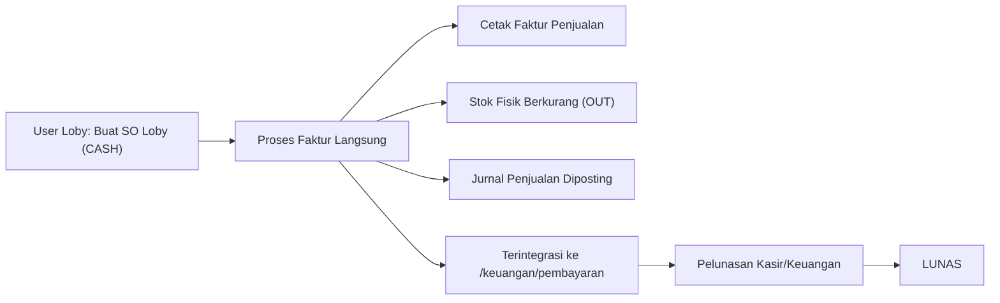

# Dokumentasi Pengembangan Modul Sales Order Loby

**Tanggal**: 26 Agustus 2026  
**Modul**: Sales & Keuangan (`sales_order_loby`)  
**Penulis**: Tim Pengembang Karisma ERP  

---

## 1. Latar Belakang & Tujuan
Sales Order pada KarismaERP sebelumnya didesain untuk transaksi penjualan sales reguler yang terikat dengan alur pengiriman logistik:
`SO (Draft/Open) -> Loading SO -> Delivery Order (DO) -> Admin SC Faktur -> Selesai DO -> Keuangan/Pembayaran`.

Namun, perusahaan juga memiliki penjualan langsung melalui **Loby (Walk-in Customer)** dengan karakteristik khusus:
1. Customer datang langsung ke Loby dan melakukan transaksi langsung di tempat.
2. Pembayaran **hanya menggunakan CASH**.
3. Barang langsung diambil oleh customer setelah transaksi (tidak membutuhkan proses Loading SO, perencanaan rute, maupun Delivery Order).
4. User Loby dapat membuat Sales Order sekaligus menerbitkan **Faktur Penjualan** dan mencetak faktur secara mandiri.
5. Transaksi otomatis terintegrasi dengan modul Keuangan (`/keuangan/pembayaran`) dan membentuk pembukuan jurnal akuntansi standar.
6. **Tidak mengubah atau merusak alur Sales Order Sales reguler yang sudah berjalan.**

---

## 2. Alur Transaksi Sales Order Loby



1. **Step 1 — Pembuatan SO Loby**:
   - User Loby membuka menu **Sales → Sales Order Loby**.
   - Mengisi nomor SO (otomatis: `SO-LBY/dmy/XXXX`), tanggal, customer, gudang stok, dan item barang beserta nomor lot & tanggal kedaluwarsa.
   - Metode pembayaran terkunci otomatis pada opsi **`CASH`**.
   - Stok ter-reserve pada `tberp_stock_batch`.
2. **Step 2 — Penerbitan Faktur Langsung**:
   - Dari detail SO Loby, User Loby menekan tombol **Proses Faktur Sekarang**.
   - Sistem menerbitkan nomor faktur (`[PREFIX]INVdmyXXXX`), memotong stok fisik secara realtime (`OUT`), mencatat ledger, dan memposting jurnal otomatis via `Accounting_source_service`.
   - Status faktur diset ke **`selesai_do`** dengan `so_source = 'LOBY'`.
   - Status SO Loby berubah menjadi **`completed`**.
3. **Step 3 — Cetak Faktur**:
   - User Loby dapat langsung mencetak faktur penjualan resmi untuk diserahkan ke customer bersama barang fisik yang diambil.
4. **Step 4 — Integrasi Keuangan & Pembayaran**:
   - Tagihan faktur langsung muncul pada daftar tagihan belum lunas di modul **Keuangan & Pembayaran** (`/keuangan/pembayaran`) dan kasir dapat memproses pelunasan kas.

---

## 3. Rincian Teknis & Database

### A. Penyesuaian Kolom Database
1. **`tbso_sales_order`**:
   - Kolom `so_source` (`VARCHAR(20) DEFAULT 'SALES'`): bernilai `'LOBY'` untuk menandai transaksi Loby.
2. **`tbso_faktur_penjualan`**:
   - Kolom `so_source` (`VARCHAR(20) DEFAULT 'SALES'`).
   - Kolom `tanggal_selesai_do` (`DATE NULL`): terisi tanggal faktur Loby saat diterbitkan.

### B. Isolasi dari Modul Logistik
Pada model `M_SalesOrder.php`, query pemuatan SO untuk rute, loading, dan DO (`get_admin_sc_ready_so`, `get_so_by_rute`, `get_open_so_for_routing`, `count_open_so_for_routing`, `get_open_so_customer_route_options`, `_pending_faktur_rute_sql`) telah dilengkapi filter pelindung:
```sql
(so.so_source IS NULL OR so.so_source != 'LOBY')
```
Hal ini memastikan transaksi SO Loby tidak akan pernah masuk ke antrean Loading SO maupun Delivery Order Logistik.

### C. File-file Baru:
1. **Controller**:
   - `application/controllers/sales/C_SalesOrderLoby.php`: Controller penanganan list, form, update, cancel, faktur langsung, detail, print faktur, dan AJAX stok lookup.
2. **Model**:
   - `application/models/M_SalesOrderLoby.php`: Model penanganan CRUD SO Loby, pembuatan nomor dokumen, reservasi stok, faktur langsung, pemotongan stok fisik `OUT`, dan posting jurnal akuntansi.
3. **Views**:
   - `application/views/content/sales/so_loby_list.php`: Daftar transaksi SO Loby dengan filter tanggal & status.
   - `application/views/content/sales/so_loby_form.php`: Form pembuatan/edit SO Loby dengan lookup customer & stok gudang.
   - `application/views/content/sales/so_loby_detail.php`: Halaman detail SO Loby & status faktur terkait.
   - `application/views/content/sales/so_loby_faktur_form.php`: Form konfirmasi penerbitan faktur penjualan instan.
   - `application/views/content/sales/so_loby_print_faktur.php`: Layout cetak faktur penjualan Loby siap print.

### D. File yang Dimodifikasi:
1. `application/config/routes.php`: Mendaftarkan endpoint URL `sales_order_loby`.
2. `application/views/partial/main/sidebar.php`: Menambahkan menu navigasi **Sales Order Loby**.
3. `application/models/M_SalesOrder.php`: Menambahkan filter pengecualian transaksi Loby pada alur logistik reguler.

---

## 4. Panduan Penggunaan Modul Loby

1. **Akses Menu**:
   - Buka menu navigasi **Sales → Sales Order Loby** (`/sales_order_loby`).
2. **Membuat Transaksi Baru**:
   - Klik tombol **Buat SO Loby Baru**.
   - Pilih **Customer** dan **Lokasi Gudang Stok**.
   - Klik tombol **Tambah Barang dari Stok** untuk memilih barang, no lot, dan exp date yang tersedia.
   - Masukkan **Qty Ambil** dan sesuaikan **Harga Satuan** / **Diskon** jika ada.
   - Klik tombol **Simpan Sales Order Loby**.
3. **Menerbitkan Faktur Langsung**:
   - Pada halaman detail SO Loby atau list SO Loby, klik tombol **Faktur / Proses Faktur Sekarang**.
   - Periksa nomor faktur dan tanggal faktur, lalu klik tombol **Terbitkan Faktur & Selesaikan**.
   - Faktur otomatis diterbitkan, stok fisik berkurang, dan jurnal akuntansi tercatat.
4. **Mencetak Faktur**:
   - Klik tombol **Cetak Faktur** untuk mencetak struk/faktur penjualan untuk customer.
5. **Pelunasan di Modul Keuangan**:
   - Buka menu **Keuangan → Pembayaran** (`/keuangan/pembayaran`).
   - Faktur penjualan Loby otomatis terdaftar dan dapat diproses pelunasannya oleh kasir/keuangan.
