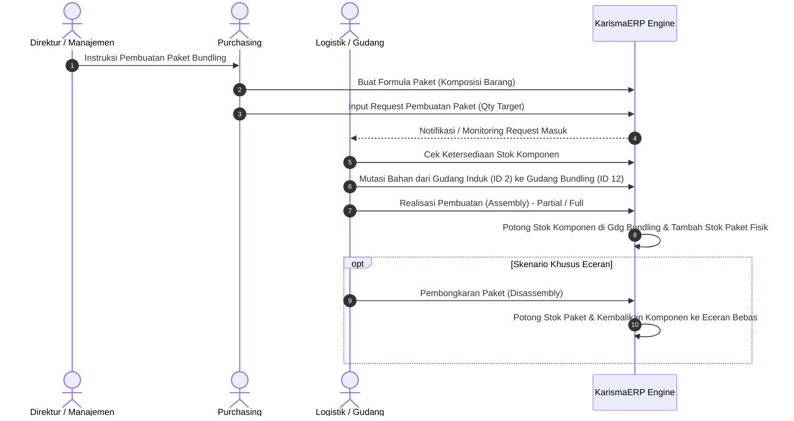

# Panduan Penggunaan Modul Paket Bundling (Purchasing & Logistik) — KarismaERP

**Tanggal:** 07 September 2026  
**Status:** Aktif / Siap Digunakan  
**Aplikasi:** KarismaERP (CodeIgniter 3)  

---

## 1. Latar Belakang & Konsep Paket Bundling

Dalam strategi penjualan dan promosi produk, manajemen/Direktur menginstruksikan pembuatan **Paket Bundling** (misalnya: *Paket Jitu*, *Paket Super Promo*, dll).  
Satu paket bundling terdiri dari beberapa barang komponen dengan jumlah tertentu per paket.

Contoh Komposisi:
- **1 Paket Jitu** =
  - 1 Ltr Spontas
  - 1 Ltr Round Up
  - 1 Pcs Kaos Jitu

Jika Purchasing meminta pembuatan **250 Box Paket Jitu**, sistem secara otomatis menghitung total kebutuhan barang:
$$\text{Total Kebutuhan} = \text{Isi per Paket} \times \text{Jumlah Paket}$$
- Spontas 1 Ltr: $1 \times 250 = 250\text{ Ltr}$
- Round Up 1 Ltr: $1 \times 250 = 250\text{ Ltr}$
- Kaos Jitu: $1 \times 250 = 250\text{ Pcs}$

---

## 2. Alur Kerja (End-to-End Workflow)

---

## 3. Fitur di Sisi Purchasing

### A. Master Formula Bundling (`/purchasing/bundling/formula`)
- Tempat Purchasing mendaftarkan formula paket dan komposisi detail tiap komponen.
- Menentukan barang induk paket (misal: `PKT-JITU-01`) dan daftar barang penyusunnya beserta `qty_per_paket`.

### B. Request Paket Bundling (`/purchasing/bundling/request`)
1. **Buat Request Baru (`/purchasing/bundling/request/create`)**:
   - Pilih barang paket bundling.
   - Masukkan tanggal target selesai dan jumlah box/paket yang diminta.
   - Sistem secara otomatis menampilkan tabel kebutuhan komponen beserta jumlah total yang dibutuhkan.
   - Klik **Simpan Request**. Nomor dokumen otomatis digenerate (contoh: `RPB-20260907-0001`).
2. **Monitoring & Detail (`/purchasing/bundling/request/detail/{id}`)**:
   - Melihat progress realisasi pembuatan oleh tim Logistik (Persentase Progress, Qty Realisasi, Sisa yang belum dibuat).
   - Melihat histori perakitan (assembly) per tanggal dan operator.

---

## 4. Fitur di Sisi Logistik

### A. Monitoring Request Purchasing (`/logistik/bundling/monitoring`)
- Logistik melihat daftar seluruh request paket yang masuk dari Purchasing.
- Status request:
  - `MENUNGGU_PROSES`: Belum ada assembly yang dilakukan.
  - `PROSES_SEBAGIAN`: Sudah dirakit sebagian (partial fulfillment).
  - `SELESAI`: Seluruh target paket telah selesai dirakit ($100\%$).

### B. Mutasi Bahan ke Gudang Bundling (`/logistik/bundling/mutasi/{id_request}`)
- Sebelum perakitan fisik dilakukan, bahan komponen dipindahkan dari **Gudang Induk (ID 2)** ke **Gudang Bundling (ID 12)**.
- Sistem menyediakan tombol cepat untuk memutasi bahan sesuai sisa kebutuhan request.
- Mutasi bahan tercatat resmi di kartu stok persediaan (`tberp_stock_ledger` & `tberp_stock_batch`) dengan tipe referensi `MUTASI_BUNDLING`.

### C. Realisasi Pembuatan Paket (Assembly) (`/logistik/bundling/assembly/create/{id_request}`)
- Logistik dapat merakit sebagian (contoh: target 250 box, dirakit 100 box terlebih dahulu).
- Sistem memvalidasi apakah stok bahan di Gudang Bundling mencukupi untuk jumlah box yang dirakit.
- Saat disimpan (`ASM-YYYYMMDD-XXXX`):
  1. Stok komponen di Gudang Bundling berkurang sebesar $(\text{Qty Assembly} \times \text{Isi per Paket})$.
  2. Stok paket jadi bertambah di Gudang Bundling sebesar $\text{Qty Assembly}$.
  3. HPP paket otomatis dihitung dari total HPP komponen yang digunakan.
  4. Status request Purchasing otomatis ter-update (`PROSES_SEBAGIAN` atau `SELESAI`).

---

## 5. Mekanisme Penjualan Eceran & Pembongkaran (Disassembly)

### Aturan Anti-Double Counting (Pencegahan Stok Ganda)
> [!IMPORTANT]
> Barang yang sudah dirakit fisik menjadi Paket Bundling **tidak boleh** tercatat ganda sebagai stok eceran bebas.  
> Jika ada permintaan customer untuk membeli barang satuan (eceran), namun stok komponen bebas habis sementara stok paket bundling masih tersedia, Logistik **WAJIB** melakukan proses **Pembongkaran Paket (Disassembly)** terlebih dahulu.

### Cara Melakukan Pembongkaran Paket (`/logistik/bundling/disassembly/create`)
1. Buka menu **Pembongkaran Paket (Disassembly)** di Logistik.
2. Pilih kode paket bundling yang akan dibongkar dan tentukan gudang asal (misal Gudang Bundling).
3. Masukkan jumlah box yang akan dibongkar (misal: 10 Box).
4. Klik **Proses Pembongkaran**.
5. Dampak sistematis:
   - Stok Paket Bundling berkurang 10 Box.
   - Stok masing-masing barang komponen bertambah kembali (10 unit per komponen) dan berstatus eceran bebas.
   - Tercatat di kartu stok dengan dokumen `DSB-YYYYMMDD-XXXX`.

---

## 6. Audit Trail & Kartu Stok (Single Source of Truth)

Semua pergerakan barang dalam modul Bundling terintegrasi langsung dengan kartu stok KarismaERP:
| Jenis Transaksi | Dokumen | Gudang | Mutasi Barang | Tipe Ledger |
| :--- | :--- | :--- | :--- | :--- |
| Mutasi Komponen | KIUMTSI... | Gdg 2 $\rightarrow$ Gdg 12 | Komponen | `MUTASI_BUNDLING` |
| Assembly Paket | ASM... | Gdg 12 | Komponen: **OUT**, Paket: **IN** | `ASSEMBLY_PAKET` |
| Disassembly Paket | DSB... | Gdg 12 | Paket: **OUT**, Komponen: **IN** | `DISASSEMBLY_PAKET` |
